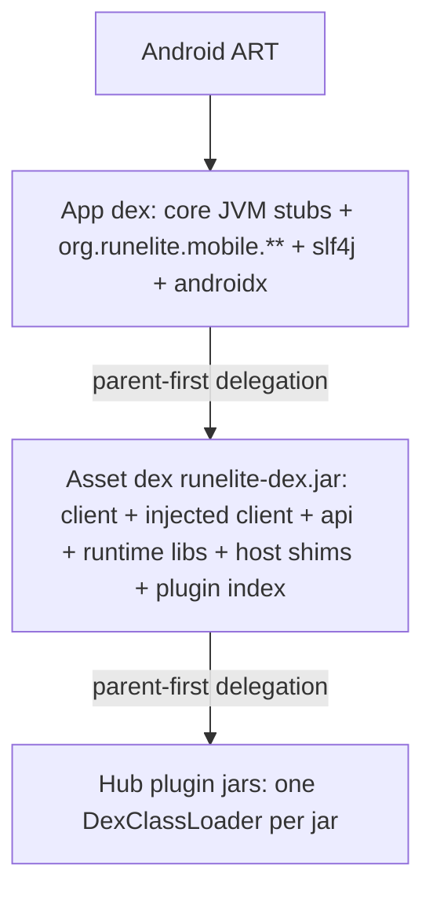

# RuneLite Mobile

**Audience:** everyone who found this repository
**Read this when:** you want a 60-second orientation, a build, or a pointer into the deep dives
**Verified against:** `MainActivity.java:60-68`, `android/build.gradle:32`, `RuneLiteHost.java:45`,
`ClientUpdater.java:33`, `settings.gradle:18-20`

RuneLite Mobile runs Old School RuneScape on Android by running RuneLite's *official* injected client
on the platform's own runtime, ART. It ships no custom game client and no game assets: at build time
it downloads RuneLite's official client jars and dexes them into an asset the app loads at runtime,
supplying the desktop JVM surface the pre-compiled client expects. An `ios/` RoboVM target exists but
is a skeleton that renders nothing.

---

## 1. What this is

RuneLite Mobile is an unofficial Android port of [RuneLite](https://runelite.net), the open-source
Old School RuneScape client. The port does not reimplement the game or the client: `android/build.gradle`'s
`syncRuneLiteJars` task fetches RuneLite's pinned `bootstrap.json`, downloads the official injected
client and its runtime libraries, and `downloadAndDexJar` ASM-transforms and d8-dexes them into
`android/src/main/assets/runelite-dex.jar`. At runtime the app installs a `DexClassLoader` over that
asset, loads the obfuscated `client` class, and asks it to paint into a 765x503 software buffer that
lives in `core/`'s hand-written `java.awt` stubs.

The entire difficulty is that Android has no `java.desktop`: the port supplies a working subset of
AWT/Swing, replaces `sun.misc.Unsafe` and `java.lang.ProcessHandle`, and drives the client's own
frame loop from the app side (`MainActivity.bootstrapGameClient`). The `ios/` module is a RoboVM
launcher skeleton (`ios/robovm.xml`, `IOSLauncher`) that builds an unsigned IPA but renders nothing.

**What this is not.** It is not a RuneScape client, not a modified RuneLite build, and not affiliated
with Jagex or the RuneLite project. It includes no game assets; the client jar is downloaded at build
time and re-served to devices by this repository's own CI release (see
[client-updates.md](docs/client-updates.md)).

**What you need.** An Android device (or emulator) with the app installed, a Jagex account, and — for
anything past a build — the Android SDK platform-tools. The target device is expected to run with
`dalvik.vm.usejit=false`, which is why AOT compilation is a required install step rather than an
optimisation.

**Key runtime constants.** The client's own frame size is 765x503 (`GAME_W`/`GAME_H`), the frame-pacing
target is 60 fps (`FPS_TARGET`), and a single-finger press is held off for 120 ms
(`TAP_PRESS_DELAY_MS`) so a two-finger gesture cannot fire a stray walk. All three live in
`MainActivity` (`MainActivity.java:60-94`); change the frame size only together with `appletPixels`
and `AWTBridge.activePixels/activeWidth/activeHeight`.

---

## 2. Status

State as of this writing. Numbers that move with upstream releases are described qualitatively.

| Feature | State | Where documented |
|---|---|---|
| Software 3D rendering into a 765x503 frame | works | [rendering.md](docs/rendering.md) |
| Touch → mouse (press/drag/release/click) | works | [input.md](docs/input.md) |
| Two-finger camera drag (middle-button emulation) | works | [input.md](docs/input.md) |
| On-screen keyboard bridge (`KB` bar → AWT `KeyEvent`s) | works | [input.md](docs/input.md) |
| Native side panel (Plugins / Config / Host tabs) | works | [side-panel.md](docs/side-panel.md) |
| RuneLite plugin runtime (indexed plugins instantiate) | works | [plugin-runtime.md](docs/plugin-runtime.md) |
| Plugin config persistence | works | [plugin-runtime.md](docs/plugin-runtime.md) |
| Third-party Plugin Hub jars | works | [third-party-plugins.md](docs/third-party-plugins.md) |
| Client auto-update (SHA-256 verified, atomic swap) | works | [client-updates.md](docs/client-updates.md) |
| Jagex account login (browser OAuth + loopback callback) | works | [login-and-sessions.md](docs/login-and-sessions.md) |
| iOS | skeleton only (no rendering) | — |

There is no in-game IME: the keyboard is a floating bar that injects AWT `KeyEvent`s through the app's
own `dispatchKeyText`/`deliverKeyEvent`, and game chat sees them as ordinary key events.

A `works` row means the subsystem is wired end-to-end and produces a visible result on device, not
that it is feature-complete. Known intentional limits:

- Swing-based plugin panels are not rendered. Plugins that register a side panel are listed, and tapping
  one opens its config instead; the panel itself is not available on mobile.
- A small set of core plugins is excluded from load because they need the desktop shell, LWJGL/JNA, or
  a browser. Excluding a plugin that another depends on is not allowed, so the exclusions cascade.
- The iOS target builds and launches but draws nothing.
- There is no automated test suite; see section 10.

---

## 3. The 60-second tour

Three class loaders, chained parent-first, plus the app's own classes. Anything the app dex defines
wins; anything only the asset dex defines is invisible to app-dex code, so cross-loader links are
reflection-only.



Why the port is hard:

- **No `java.desktop`.** Android ships none of `java.awt`/`javax.swing`/`java.applet`. `core/`
  defines the surface the pre-compiled jars reference, and must keep `--limit-modules
  java.base,jdk.unsupported` (`core/build.gradle:11`) to legally declare `java.*` packages. See
  [core-stubs.md](docs/core-stubs.md).
- **No `sun.misc.Unsafe`.** The injected client reads array offsets and calls `copyMemory`; the build
  rewrites those call sites to `org.runelite.mobile.UnsafeHelper` with ASM. See
  [build-and-release.md](docs/build-and-release.md) and [core-stubs.md](docs/core-stubs.md).
- **ART only runs dex.** The client ships as JVM class files, so the build dexes them ahead of time;
  nothing is dexed on the device. See [build-and-release.md](docs/build-and-release.md).
- **JIT is disabled on the target device** (`dalvik.vm.usejit=false`), so the client jar must be
  AOT-compiled with `cmd package compile` after every install and every client update. See
  [device-runbook.md](docs/device-runbook.md) and [client-updates.md](docs/client-updates.md).
- **The client is obfuscated and version-specific.** A few hooks reach into `client`/`yw`/`fq`/`fa`
  by name; those names must be re-derived on a client bump. See [rendering.md](docs/rendering.md) and
  [telemetry-assessment.md](docs/telemetry-assessment.md).

---

## 4. Build

### Prerequisites

| Requirement | Detail |
|---|---|
| JDK | 11 (source/target 11 for every `JavaCompile`; CI uses Zulu 11) |
| Android SDK | `compileSdk 34`, with build-tools (the pipeline invokes `d8`) |
| `local.properties` | `sdk.dir=<path>` (machine-specific, gitignored) |
| Network | Required by `syncRuneLiteJars` and the `dexHubPlugin` manifest fetch |
| Gradle | Wrapper 8.5 (`gradle/wrapper/gradle-wrapper.properties`) |
| Xcode (iOS only) | macOS + Xcode, for `:ios:robovmIPABuild` |

### Commands

| Command | Network | What it produces |
|---|---|---|
| `./gradlew :core:compileJava` | no | `core` jar of JVM stubs (no Android SDK needed) |
| `./gradlew :android:assembleDebug` | yes | debug APK |
| `./gradlew :android:assembleRelease` | yes | release APK (`android/build/outputs/apk/release/`) |
| `./gradlew :ios:robovmIPABuild` | yes | `ios/build/robovm/RuneLiteMobile.ipa` (macOS + Xcode only) |
| `./gradlew :android:verifyHostLinks` | yes | link-check report; non-zero exit on a gap |
| `./gradlew :android:dexHubPlugin -PhubPlugin=<internalName>` | yes | a dexed Plugin Hub jar |

An offline Android build fails in `preBuild → downloadAndDexJar`, never in `:core:compileJava`:
`afterEvaluate` wires the asset codegen ahead of every compile/dex task (`android/build.gradle:805-815`).
`verifyHostLinks` depends on the codegen and the release javac output but is deliberately **not**
wired into `assembleRelease`. Full pipeline detail is in
[build-and-release.md](docs/build-and-release.md).

### What a build produces

| Output | Produced by | Used by |
|---|---|---|
| `android/build/rl-jars/*.jar` | `syncRuneLiteJars` | compile + dex steps |
| `android/src/main/assets/runelite-dex.jar` | `downloadAndDexJar` | the APK's asset dex |
| `android/src/main/assets/client-version.txt` | `downloadAndDexJar` | updater version compare |
| `android/src/main/assets/rl-dexer.jar` | checked in (regenerated when d8 changes) | on-device hub dexing |
| APK | `assembleRelease` | device install |
| unsigned IPA | `:ios:robovmIPABuild` | iOS (skeleton) |

The CI workflow publishes the jar, the version file, the checksum and the APK as release assets; the
app's updater consumes them by exact name. See [client-updates.md](docs/client-updates.md).

---

## 5. Install on a device

1. Build: `./gradlew :android:assembleRelease`.
2. Install: `adb install -r android/build/outputs/apk/release/android-release.apk` (same debug signing
   key, so app data survives an upgrade).
3. AOT-compile the shipped client jar (mandatory on a JIT-disabled device):
   ```bash
   adb shell cmd package compile -m speed -f --secondary-dex org.runelite.mobile
   adb shell cmd package compile -m speed -f org.runelite.mobile
   ```
4. Verify: `adb shell pm art dump org.runelite.mobile` must show `[status=speed]`, not `verify`.
5. Launch; sign in with a Jagex account; pick a character; Play.

Re-run step 3 after **every APK install** and after **every client-jar update**. A new install lands
in a new `/data/app/~~…==/` directory whose path is part of the odex's class-loader context, so ART
rejects the existing `speed` odex and silently falls back to `verify`. The APK must not be debuggable:
the ART Service rewrites `-m speed` to `verify` for debuggable packages. The launcher shows a red
`NOT AOT-COMPILED` line and the Host tab has a `client AOT` row; both come from
`ClientUpdater.clientDexAotStatus`, an mtime heuristic. Full procedure and semantics in
[device-runbook.md](docs/device-runbook.md) and [client-updates.md](docs/client-updates.md).

---

## 6. How it works (L1)

### 6.1 Three dex loaders

`MainActivity.bootstrapGameClient` builds a `DexClassLoader` whose parent is the app classloader, then
loads `client` from it. `RuneLiteHost` reaches everything RuneLite-specific — the Guice injector,
`OkHttpClient`, `RuneLiteAPI.CLIENT` — by name through that child loader; the app dex has no
compile-time `net.runelite.*`/`com.google.inject.*`/`okhttp3.*` reference at all.

- Parent-first means app-dex classes shadow asset-dex classes; host-replaced Swing classes are stripped
  out of the asset dex and replaced by shims compiled *into that same dex*.
- Hub plugins get their own `DexClassLoader` per jar, parented to the client loader, so a hub plugin
  sees the same `net.runelite.api` classes as a core plugin.
- The only cross-loader links are lambdas/fields the host installs reflectively (for example
  `ClientToolbar.navigationListener`).

See [plugin-runtime.md](docs/plugin-runtime.md) for the shim/loader contract.

### 6.2 Boot sequence at a glance

1. `onCreate` sets the JVM properties Android lacks, binds the display buffer, registers the UI thread
   as the EDT, and installs the text renderer.
2. The launcher signs in (device browser + loopback callback) or imports session tokens.
3. `bootstrapGameClient` applies `JX_SESSION_ID`/`JX_CHARACTER_ID`/`JX_DISPLAY_NAME`, parses
   `jav_config.ws`, creates the `DexClassLoader`, and instantiates `client`.
4. It binds the `ClientConfiguration` and `Callbacks` proxies and starts the client loop.
5. `RuneLiteHost.start` (background thread) builds the injector and posts the plugin lifecycle to the
   UI thread; `startPlugins` loads the plugin index and starts plugins.
6. The render thread waits on `renderLock` and presents one client frame per `frameSeq` bump.

Full sequence with method names is in [architecture.md](docs/architecture.md).

### 6.3 The JVM surface

`core/` is a plain `java-library` with no declared dependencies. It compiles with
`--limit-modules java.base,jdk.unsupported` so it can define `java.awt.*`, `javax.swing.*` and friends.
It contains both hand-written classes (the pixel/text/geometry code) and generated data-only stubs.

- `Graphics`/`BufferedImage` implement a shared **non-premultiplied** ARGB `int[]` with opaque fast
  paths for the game frame; `BufferedImage.getGraphics()` returns a `Graphics2D` because `Hooks.draw`
  casts to it.
- `UnsafeHelper`, `ProcessHandle`/`ProcessHandleImpl` and `javax.imageio.ImageIO` replace missing JVM
  APIs; the first two are ASM-rewritten into the client at build time, not linked normally.
- Generated stubs carry a marker header and are regenerated by `tools/gen_stubs.py`; hand-written files
  are never overwritten. A stub's instance/static shape is taken from the real call-site opcode.

See [core-stubs.md](docs/core-stubs.md) and [tools.md](docs/tools.md).

### 6.4 The plugin runtime

`PluginManager`'s normal discovery is Guava's `ClassPath.from(...)`, which cannot work on ART, so plugin
discovery is a **build artifact**: `downloadAndDexJar` scans the client jar with ASM and writes
`runelite-plugin-index.txt` (every `@PluginDescriptor` subclass of `Plugin`, minus
`android/plugin-exclusions.txt`). `RuneLiteHost.startPlugins` reads that index off the client loader and
hands it to `PluginManager.loadPlugins` — bulk first, then one class at a time so a single bad plugin is
logged instead of aborting startup.

- Exclusions are cascaded: a plugin named in another's `@PluginDependency` cannot be excluded, which is
  why `BankTagsPlugin` stays in.
- The lifecycle runs on the Android UI thread, registered as the EDT via `AWTBridge.registerUiThread`.
- Plugin config is persisted through RuneLite's own profile store; `RuneLiteHost.flushConfig` calls
  `sendConfig` on panel toggles and on `onStop`.

See [plugin-runtime.md](docs/plugin-runtime.md) and [side-panel.md](docs/side-panel.md).

---

## 7. Repository layout

```text
runelite-mobile/
  build.gradle            root buildscript (AGP 8.2.2), Java 11 for all projects
  settings.gradle         modules :core :android :ios; RuneLite maven repo
  gradle.properties       android.useAndroidX=true (only line)
  gradlew, gradle/        Gradle wrapper 8.5
  core/                   JVM stubs (java.*, javax.*, org.runelite.mobile.**), java-library
  android/
    build.gradle          app config + the whole codegen pipeline (1500+ lines)
    plugin-exclusions.txt FQCNs the host does not load
    hostlink-ignore.txt   link-check ignore prefixes
    hostlink-platform-extra.txt  device-verified platform members
    src/main/java/org/runelite/mobile/**   the Android host (MainActivity, RuneLiteHost, ...)
    src/main/assets/      rl-dexer.jar (tracked) + generated runelite-dex.jar/client-version.txt
  hostshims/              source of the net.runelite.client.ui.* replacements (not a Gradle module)
  tools/                  gen_stubs.py, RefScan.java, JdkInfo.java, HostLinkCheck.java
  docs/                   the deep dives linked below
  ios/                    RoboVM skeleton (build.gradle, robovm.xml, IOSLauncher)
```

Do not be misled by root-level dumps: `gamepack_*.jar`, `injected_client.jar`, `runelite-api.jar`,
`temp_disasm/`, `jdb_in`, `screencap.png` and the `java_pid*.hprof` files are manual debugging
experiments, not build inputs (the build downloads its own copies). See
[code-map.md](docs/code-map.md).

---

## 8. Documentation index

The docs come in levels: this README is L0/L1, the per-subsystem pages are L2, and
[code-map.md](docs/code-map.md) is the L3 per-file catalogue. Read the L2 page that owns the
subsystem you are touching; use the code map when you need a specific file.

| Page | Level | Read it when | Audience |
|---|---|---|---|
| [architecture.md](docs/architecture.md) | L2 | you need the module map, loaders and boot sequence | developer |
| [build-and-release.md](docs/build-and-release.md) | L2 | you are building, CI-ing, or changing the codegen pipeline | builder/operator |
| [rendering.md](docs/rendering.md) | L2 | the screen is wrong, or you touch the frame path | developer |
| [input.md](docs/input.md) | L2 | touch, camera drag, or the keyboard bridge misbehaves | developer |
| [core-stubs.md](docs/core-stubs.md) | L2 | you add or fix a `java.awt`/`javax.swing` stub | developer |
| [plugin-runtime.md](docs/plugin-runtime.md) | L2 | you work on `RuneLiteHost`, shims, or config | developer |
| [side-panel.md](docs/side-panel.md) | L2 | you use or change the native panel | developer/operator |
| [login-and-sessions.md](docs/login-and-sessions.md) | L2 | login or session-token handling | developer |
| [client-updates.md](docs/client-updates.md) | L2 | the updater or AOT-status logic | developer/operator |
| [third-party-plugins.md](docs/third-party-plugins.md) | L2 | you install a Plugin Hub jar | developer/operator |
| [diagnostics.md](docs/diagnostics.md) | L2 | you need logs, the gfx self-test, or conformance | operator/developer |
| [device-runbook.md](docs/device-runbook.md) | L2 | you are installing/updating on a physical device | operator |
| [tools.md](docs/tools.md) | L2 | you run or change the build-time tools | developer |
| [troubleshooting.md](docs/troubleshooting.md) | L2 | something visibly failed | operator/developer |
| [code-map.md](docs/code-map.md) | L3 | you need a specific file or symbol | implementer |
| [telemetry-assessment.md](docs/telemetry-assessment.md) | L3 | you are re-deriving client-internal names on a bump | developer |

After a RuneLite client bump, the plugin index, the obfuscated client-internal names and the generated
stubs can all change. The regeneration procedures live in
[tools.md](docs/tools.md) and [telemetry-assessment.md](docs/telemetry-assessment.md); the
[build-and-release.md](docs/build-and-release.md) pipeline regenerates the index and the dex on every
build. If a document and the source disagree, the source wins — line numbers in these pages are hints.

---

## 9. Troubleshooting at a glance

| Symptom | First check |
|---|---|
| Static grey screen, nothing draws | A no-op `callbacks.draw` proxy; the throttled `callbacks.draw` log shows `world=`/`bridge=` | [troubleshooting.md](docs/troubleshooting.md) |
| Frozen world with a live minimap | The 3D rasterizer was not re-pointed at the display buffer | [troubleshooting.md](docs/troubleshooting.md) |
| Grey walls, black ground/trees | The palette pointer (`fa.ak`) was retargeted at the frame | [troubleshooting.md](docs/troubleshooting.md) |
| Taps do nothing but logcat prints `Dispatch mouse id=…` | A missing event-stub member (`NoSuchMethodError` caught as `Throwable` after the log line) | [troubleshooting.md](docs/troubleshooting.md) |
| The `KB` button is missing or typing does nothing | The button stays `GONE` until the client runs; incomplete `KeyEvent` stubs silently drop chars | [troubleshooting.md](docs/troubleshooting.md) |
| Extremely low framerate, `verify` in `pm art dump` | The client jar is not AOT-compiled | [troubleshooting.md](docs/troubleshooting.md) |
| A plugin is listed as enabled/active but does nothing | Instantiation counts prove nothing; run plugin conformance | [troubleshooting.md](docs/troubleshooting.md) |
| `Writable dex file … is not allowed` | A hub plugin was left on shared storage instead of imported | [troubleshooting.md](docs/troubleshooting.md) |
| `Unsupported dynamic constant` at build time | The ASM transform was gated per class instead of running on all | [troubleshooting.md](docs/troubleshooting.md) |

---

## 10. Provenance and status

This is an **unofficial** port. It runs the official RuneLite client and the official OSRS injected
client through a compatibility layer; it ships neither the game nor a modified client, and it is not
affiliated with Jagex or the RuneLite project.

- The repository is on `master` with 17 commits at the time of writing.
- There are **no tests in the tree**; verification is manual, on-device. The only automated checks are
  `:android:verifyHostLinks` (build-time link check) and the runtime `GraphicsSelfTest` /
  plugin-conformance probes.
- The port has been exercised on a device with `dalvik.vm.usejit=false`; every performance claim in
  the docs assumes AOT compilation, because interpreted execution is roughly an order of magnitude
  slower.
- **No licence file is present.** There is no `LICENSE`, `COPYING` or `NOTICE` anywhere in the tree;
  none is invented here, and the absence is called out deliberately.
- `android/src/main/assets/` holds `rl-dexer.jar` (the only tracked file, used for on-device hub
  dexing) plus the generated `runelite-dex.jar` and `client-version.txt`, which `.gitignore` excludes.
