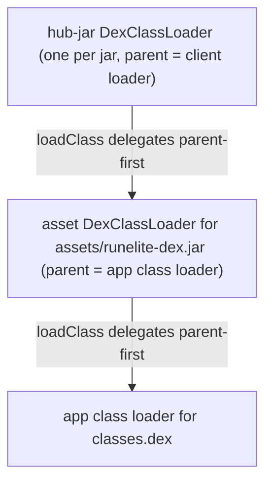
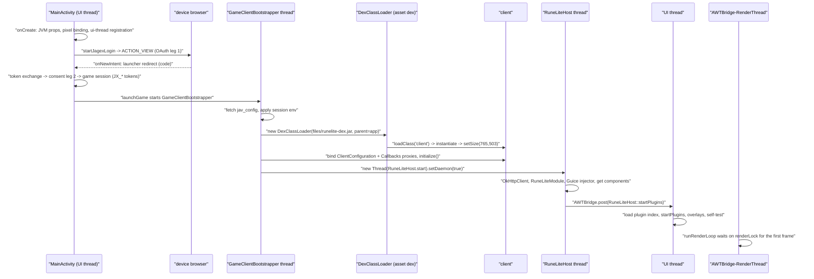

# Architecture

**Audience:** developer
**Read this when:** you need the shape of the port before reading any subsystem page.
**Verified against:** `settings.gradle`, `build.gradle`, `core/build.gradle`, `ios/build.gradle`, `android/build.gradle`, `android/src/main/java/org/runelite/mobile/MainActivity.java`, `android/src/main/java/org/runelite/mobile/host/RuneLiteHost.java`, `android/src/main/java/org/runelite/mobile/host/MobilePluginHub.java`, `.gitignore`

## 1. The shape of the port

The app ships **no game client of its own**. At build time it downloads RuneLite's official
*injected* client, the game `client`, `runelite-api`, and the runtime libraries pinned by
`bootstrap.json`, then runs all of them through `d8` into a single asset dex
(`android/build.gradle:489-492`, asset `android/src/main/assets/runelite-dex.jar`). At runtime the
app hands that dex to ART and supplies the desktop-JVM surface the client expects: a
`java.awt`/`javax.swing` stub set living in `core/`, a pixel buffer wired to an Android
`Bitmap`, and a small reflection bridge (`org.runelite.mobile.**`). RuneLite's own Swing UI is
stripped from the asset dex and replaced by shims (`hostshims/`); the client's plugin manager runs
unmodified against a build-time plugin index. The port therefore owns the *host*, not the game.

The desktop surface the client needs is small but load-bearing. `core/` provides it: the
`java.awt` component/event/graphics types the client compiles against, `javax.swing` types used by
plugin code, `java.applet.Applet`/`AppletContext`, `java.awt.image.BufferedImage`, and the
`java.lang.ProcessHandle`/`sun.misc.Unsafe` replacements the client's indirect references resolve
to. None of this exists on Android, so `core/` implements it as real code where the client reads
results (pixel maths, image access) and as data-only stubs where the client only needs the type to
load. `core/build.gradle:10-12` compiles it with `--limit-modules java.base,jdk.unsupported` so a
`java.*` package may legally exist there; [core-stubs.md](core-stubs.md) owns the detail.

## 2. Three artifacts, three loaders

There are three class universes, each with its own loader. Loaders delegate **parent-first**, so
the app dex is always the ultimate parent and an app-dex class always wins over the same name in a
child dex.

The asset loader is constructed in `MainActivity.bootstrapGameClient` as
`new DexClassLoader(localJarFile, dexOutputDir, null, getClassLoader())`
(`MainActivity.java:1391-1397`); each hub jar gets its own child loader whose parent is the client
loader (`MobilePluginHub.java:27-31`, `:146`).

Parent-first has three consequences you must design around:

- **App-dex classes always win.** `java.*`, `javax.*`, `org.runelite.mobile.**` and the slf4j
  binding come from `core/` and the app, never from the RuneLite jars.
- **Asset-dex-only classes are invisible to app-dex code.** `MainActivity` has **zero**
  compile-time `import net.runelite` statements (grep: none); every client type is reached with
  `dexClassLoader.loadClass(...)` and reflection.
- **The only cross-loader links are reflection-only.** The host reaches the client by name
  (`ClientToolbar.navigationListener` is installed reflectively in
  `RuneLiteHost.installNavigationHook`, `RuneLiteHost.java:727-741`); the client reaches the host
  through app-dex proxies (`ClientConfiguration`, `Callbacks`) whose interface types are resolved
  from the child loader (`MainActivity.java:1419-1455`, `:1465-1466`).

| Universe | Loader | Contents | Built / anchored at |
|---|---|---|---|
| App dex (`classes.dex`) | the Android application class loader | `core/` stubs, `org.runelite.mobile.**`, the slf4j-simple binding, androidx/material | `android/build.gradle:829-846` |
| Asset dex `assets/runelite-dex.jar` | asset `DexClassLoader` (`parent = getClassLoader()`) | injected client, game `client`, `runelite-api` (duplicates stripped), the runtime libraries, `hostshims/` output, and the `runelite-plugin-index.txt` resource | `android/build.gradle:489-492`, `:596-600` |
| Hub jars | one `DexClassLoader` per jar (`parent = client loader`) | third-party plugin classes plus their resources | `MobilePluginHub.java:146` |

The two bridges are **dynamic proxies**, not implementors. The app cannot write
`class X implements net.runelite.api.hooks.Callbacks` because that interface lives in the child
loader; instead `Proxy.newProxyInstance(dexClassLoader, {callbacksInterface}, handler)` builds a
class in the child loader at runtime, and the handler switches on the invoked method's name
(`MainActivity.java:1465-1539`). The same technique supplies `ClientConfiguration`
(`:1419-1455`) and the OTL token requester (`:1714-1765`). This is why a missing method in the
proxy shows up as a silently defaulted return value rather than a compile error — see
[diagnostics.md](diagnostics.md).

## 3. Module map

| Path | Kind | Output artifact | Consumed by |
|---|---|---|---|
| `core/` | `java-library` (plain JVM jar) | `core/build/libs` classes: the `java.awt`/`javax.swing`/`java.applet` stubs plus `org.runelite.mobile` bridge classes | compiled into `:android`'s app dex and `:ios` |
| `android/` | AGP application | APK (`org.runelite.mobile`) **and** the generated `assets/runelite-dex.jar` | shipped to devices |
| `hostshims/` | **not a Gradle module** | classes compiled by `compileHostShims()` inside `android/build.gradle:189-233` and folded into the asset dex | the asset dex (same loader as the client, so Guice can resolve shim signature types) |
| `ios/` | RoboVM `java` project | unsigned IPA `RuneLiteMobile.ipa` | not shipped by the weekly Android gate |
| `tools/` | developer scripts / Java tools | none (invoked by hand or by `verifyHostLinks`) | developers only |
| `docs/` | prose | none | readers |

`settings.gradle` includes exactly `:core`, `:android`, `:ios` (`settings.gradle:18-20`);
`hostshims/` is absent because its sources are compiled ad hoc into the asset dex. `verifyHostLinks`
exists for this tree but is deliberately **not** wired into `assembleRelease` (`android/build.gradle:734-749`).

The asset dex is a **build output**, produced by two Gradle tasks in `android/build.gradle`:
`syncRuneLiteJars` downloads and SHA-256-verifies the pinned jars, and `downloadAndDexJar` strips
replaced classes, rewrites each class through an ASM pass, compiles the shims, runs `d8`, repacks
resources, and writes the plugin index (`android/build.gradle:288-622`). `afterEvaluate` wires
`preBuild -> downloadAndDexJar` and makes every `JavaCompile`/`dex*` task wait on
`syncRuneLiteJars` (`:805-815`), so a plain `:android:assembleRelease` regenerates the dex if
needed. `:android` compiles only against `:core`, androidx/material, and `slf4j-api` borrowed from
`android/build/rl-jars` — never against a RuneLite artifact, which is what keeps app dex free of
`net.runelite.*` (`android/build.gradle:829-846`). The full pipeline belongs to
[build-and-release.md](build-and-release.md).

> **Don't be misled by root-level files.** `gamepack_*.jar`, `injected_client.jar`,
> `runelite-api.jar`, `temp_disasm/`, `java_pid*.hprof`, `screencap.png` and `build/` are manual
> debugging dumps from past sessions, not build inputs; `.gitignore` lists each of them
> (`.gitignore:1-31`). The one tracked oddity is `jdb_in` (debugger input), which `.gitignore`
> does not cover. The real inputs are `android/build/rl-jars/*.jar` (downloaded) and
> `android/src/main/AndroidManifest.xml`.

## 4. Boot sequence

The same steps as code paths, in order:

1. `MainActivity.onCreate` (`MainActivity.java:191`) sets JVM properties, binds `AWTBridge.activePixels`
   to `appletPixels`, registers the UI thread, installs the text bridge and host context, builds the
   launcher UI, and pre-registers the dex for ART dexopt (`:283-300`).
2. `MainActivity.startJagexLogin` (`:891`) drives the browser-based OAuth flow; the redirect returns
   through `onNewIntent` (`:912`) and ends in session tokens or a manual/imported session
   (`:718-809`). Details: [login-and-sessions.md](login-and-sessions.md).
3. `MainActivity.launchGame` (`:1265`) hides the launcher and starts the `"GameClientBootstrapper"`
   thread (`:1276`).
4. `MainActivity.bootstrapGameClient` (`:1293`) fetches `jav_config`, applies `JX_*` env vars,
   chooses the dex source, builds the `DexClassLoader`, loads `client`, installs the
   `ClientConfiguration` and `Callbacks` proxies, calls `initialize()`, and enables unlocked FPS.
5. `MainActivity` starts the daemon `"RuneLiteHost"` thread calling
   `RuneLiteHost.start(clientObject, dexClassLoader)` (`:1681-1684`).
6. `RuneLiteHost.start` (`RuneLiteHost.java:155`) builds the injector and resolves core components
   (`:208-236`), then posts `RuneLiteHost.startPlugins` to the UI thread via `AWTBridge.post`
   (`:249`).
7. `RuneLiteHost.startPlugins` (`:252`) loads the plugin index, calls
   `PluginManager.loadPlugins`, registers the managers on the `EventBus`, calls
   `overlayManager.init()` and `pluginManager.startPlugins()` (`:299`), then loads sideloaded hub
   plugins and runs the graphics self-test. Details: [plugin-runtime.md](plugin-runtime.md).
8. `surfaceCreated` (`:3185`) starts the render thread, which presents client frames until
   `surfaceDestroyed`. Details: [rendering.md](rendering.md).

Two details in step 4 decide what actually runs. The dex source is
`files/runelite-dex.jar` when it is not older than the APK's bundled asset, otherwise the asset is
copied out and used (`MainActivity.java:1359-1389`); this is what lets an in-app update replace the
client without reinstalling the APK, and it is owned by [client-updates.md](client-updates.md). The
loader path is then `files/runelite-dex.jar` with `getDir("dex", MODE_PRIVATE)` as the optimized
output directory (`:1391-1397`). Step 5 loads the obfuscated top-level class literally named
`client` (`:1399-1406`) — that name and every client-internal symbol the port touches is
version-specific and must be re-derived when the client version changes
([telemetry-assessment.md](telemetry-assessment.md)).

The boot is deliberately **idempotent and guarded**: if `clientInstance != null` the bootstrap
returns immediately (`:1295-1300`), and any throw on the way through logs
`"Loader failed to bootstrap client"`, restores the launcher UI, and leaves the app in a
diagnosable state (`:1687-1707`). Failure is recoverable because the client never partially
registered itself with the host: the host thread is only started after `initialize()` returns
(`:1674-1684`). [troubleshooting.md](troubleshooting.md) maps the failure messages back to causes.

## 5. Threading model

| Thread | Created / named at | Runs | Crosses the boundary via |
|---|---|---|---|
| Android main / UI thread | `Looper.getMainLooper()` registered with `AWTBridge.registerUiThread(...)` (`MainActivity.java:217-218`) | view construction, login UI, `startPlugins`, `SwingUtilities.invokeLater`/`invokeAndWait` routing | `handler::post` (`AWTBridge` stores the executor; `RuneLiteHost:249`) |
| `"GameClientBootstrapper"` | `MainActivity.java:1276` | jav_config fetch, dex selection, loader construction, proxy installation, `client.initialize()` | publishes `clientInstance`/`clientObject`; starts the host thread |
| `"RuneLiteHost"` (daemon) | `MainActivity.java:1681-1684` | `RuneLiteHost.start`: runtime config fetch, Guice injector, component resolution | `AWTBridge.post(RuneLiteHost::startPlugins)` to the UI thread |
| client's own thread | started inside `GameEngine.initialize()` (`MainActivity.java:1652-1670`) | game loop; invokes the `Callbacks` proxy | `Callbacks.draw` → `renderLock`/`frameSeq` |
| `"AWTBridge-RenderThread"` | `surfaceCreated` (`MainActivity.java:3185-3189`) | blits the latest client frame to the `SurfaceView` | `renderLock.wait` on `frameSeq != lastDrawnSeq` (`:3242-3251`) |

Two rules follow from the table. First, **the render thread must never call `client.paint()`** —
the comment at `MainActivity.java:3236-3241` records that doing so tears frames; the loop presents
exactly the frame the client just produced, never one it drives on a timer. Second,
**guarding is by monitor, not by polling**: the client thread and the render thread rendezvous on
`renderLock` with `frameSeq`/`lastDrawnSeq` (`MainActivity.java:78`, `:133`), and anything that must
run on the UI thread is posted with `handler::post` rather than touched from another thread.

Three boundary contracts are worth naming explicitly:

- **Client thread -> render thread.** `Callbacks.draw` runs on the client thread, holds
  `renderLock` while overlay compositing and the buffer draw happen, and only then advances
  `frameSeq` (`MainActivity.java:1505-1538`). The render thread waits on the same monitor, so the
  client cannot overwrite `appletPixels` mid-copy.
- **Host thread -> UI thread.** `AWTBridge.registerUiThread(Looper.getMainLooper().getThread(),
  mainHandler::post)` (`MainActivity.java:217-218`) is what lets `SwingUtilities.invokeLater` and
  `AWTBridge.post` land on the Android main thread; `RuneLiteHost` relies on it for the
  `PluginManager` EDT assertion (`RuneLiteHost.java:245-249`).
- **UI thread -> client components.** Plugin lifecycle calls (`startPlugin`/`stopPlugin`,
  config writes) are made from the UI thread through `RuneLiteHost`, which recomputes its
  `activePlugins` snapshot after each (`RuneLiteHost.java:519-553`).

## 6. iOS

`ios/` is a RoboVM 2.3.24 skeleton (`ios/build.gradle:7`). `IOSLauncher` extends
`UIApplicationDelegateAdapter`, creates a `UIWindow` from the main screen bounds, attaches a bare
`UIViewController`, and prints a message — there is no rendering and no bridge wiring
(`ios/src/main/java/org/runelite/mobile/IOSLauncher.java`). The build is macOS + Xcode only and
produces an **unsigned** IPA (`iosSkipSigning = true`, `ios/build.gradle:26-27`;
`archs = ['arm64']`). `:ios:robovmIPABuild` is a separate CI job that does **not** gate the weekly
Android release (`.github/workflows/build.yml`). Treat iOS as a placeholder that keeps the `core/`
stubs compiling for a second target; [device-runbook.md](device-runbook.md) covers Android only.

## 7. Data flow of one frame

1. The client thread renders the world into its own pixel buffer and invokes
   `callbacks.draw(bufferProvider, Graphics, x, y)` through the `Callbacks` proxy
   (`MainActivity.java:1465-1466`, `:1477-1539`).
2. The proxy re-points the client's software rasterizer at the live buffer with
   `bindSceneRasterizerToDisplay(args[0])` (`MainActivity.java:1507`, `:2821-2850`).
3. If the host's `Hooks` is present, `hooks.draw(...)` composites plugin overlays directly into
   the client frame before anything is copied (`MainActivity.java:1523`).
4. `Graphics.drawImage(img, x, y, null)` draws that frame into `AWTBridge.activePixels`, which is
   `MainActivity.appletPixels` (`MainActivity.java:206-208`).
5. The proxy advances `frameSeq` under `renderLock`, waking the render thread.
6. The render thread copies `appletPixels` into `renderBitmap` with `setPixels(...)` and presents
   it with `canvas.drawBitmap(renderBitmap, srcRect, dstRect, scalePaint)`
   (`MainActivity.java:3242-3260`).

The invariants behind steps 3-6 — buffer agreement, the palette repoint, alpha handling and the
scale loop — are owned by [rendering.md](rendering.md). For how a tap or key reaches the client,
see [input.md](input.md); for what the runtime prints while it does, see [diagnostics.md](diagnostics.md).

The three pixel stores that must agree are bound once and never reallocated per frame:

| Store | Type | Bound by | Anchor |
|---|---|---|---|
| `MainActivity.appletPixels` | `int[GAME_W * GAME_H]` | field initialiser | `MainActivity.java:88` |
| `AWTBridge.activePixels/activeWidth/activeHeight` | same array + `765`/`503` | `onCreate` | `MainActivity.java:206-208` |
| `MainActivity.renderBitmap` | `Bitmap` `ARGB_8888`, `setHasAlpha(false)` | `surfaceChanged` | `MainActivity.java:3198-3205` |

The client frame and the presented frame are therefore the same pixels: overlays composited inside
`Hooks.draw` (step 3) are already in `appletPixels` before the render thread touches it. Nothing in
this path is timer-driven — the render thread exists to convert "the client produced a frame" into
"the surface shows that frame", and it blocks when the client is not producing one.
