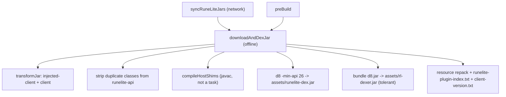

# Build and release

**Audience:** builder / operator
**Read this when:** you need to build the APK or asset dex, understand the codegen pipeline, or wire up a release.
**Verified against:** `android/build.gradle`, `core/build.gradle`, `ios/build.gradle`, `settings.gradle`, `build.gradle`, `.github/workflows/build.yml`, `android/plugin-exclusions.txt`, `android/hostlink-ignore.txt`, `android/hostlink-platform-extra.txt`, `gradle/wrapper/gradle-wrapper.properties`

This page covers everything between a clean checkout and a shipped release: toolchain
requirements, the Gradle commands that matter, and the four custom tasks that turn RuneLite's
official jars into an Android-loadable dex (`android/build.gradle`). The consuming side of the
release assets lives in [client-updates.md](client-updates.md); the module/loader context lives
in [architecture.md](architecture.md).

## Prerequisites

| Requirement | Version / value | Anchor |
|---|---|---|
| JDK | 11 (`sourceCompatibility`/`targetCompatibility` = `JavaVersion.VERSION_11`, `options.encoding = 'UTF-8'`) | `build.gradle:13-19` |
| CI JDK | Zulu 11 (`distribution: 'zulu'`, `java-version: '11'`) | `.github/workflows/build.yml:23-28` |
| Gradle wrapper | 8.5 | `gradle/wrapper/gradle-wrapper.properties:3` |
| Android Gradle Plugin | 8.2.2 | `build.gradle:8` |
| ASM | 9.6 (`asm` + `asm-commons`, on the `android` module buildscript classpath) | `android/build.gradle:6-8` |
| Android SDK | `local.properties` `sdk.dir`; `build-tools` must contain `d8`, and `platforms/android-34/android.jar` for the link list and hub dexing | `android/build.gradle:389-401`, `android/build.gradle:693` |
| Network | required by the `preBuild` chain (`bootstrap.json` + jar downloads); `:core:compileJava` and the dex step are offline | `android/build.gradle:295`, `android/build.gradle:806` |
| iOS (optional) | macOS + Xcode 15.0.1, RoboVM 2.3.24 | `.github/workflows/build.yml:63-64`, `ios/build.gradle:7` |

`settings.gradle` resolves dependencies through `google()`, `mavenCentral()` and
`https://repo.runelite.net`, with `RepositoriesMode.FAIL_ON_PROJECT_REPOS` so no project may
declare its own repository (`settings.gradle:8-15`). The module's buildscript repository is
`mavenCentral()` only (`android/build.gradle:2-3`).

`:android` config is `namespace`/`applicationId` `org.runelite.mobile`, compileSdk 34, minSdk 26,
targetSdk 34 (`android/build.gradle:16-22`). Only a `release` build type is declared
(`minifyEnabled false`, signed with `signingConfigs.debug`); debug is AGP's default
(`android/build.gradle:39-43`).

## Command reference

| Command | What it does | Needs network | Output |
|---|---|---|---|
| `./gradlew :core:compileJava` | Compiles the `java-library` JRE stubs. No SDK, no dependencies (`core/build.gradle` dependency block is empty) | No | `core/build/classes/java/main/` |
| `./gradlew :android:assembleDebug` | Full debug APK; runs `preBuild` → `downloadAndDexJar` → `syncRuneLiteJars` | Yes | `android/build/outputs/apk/debug/` |
| `./gradlew :android:assembleRelease` | Release APK the CI ships | Yes | `android/build/outputs/apk/release/android-release.apk` |
| `./gradlew :ios:robovmIPABuild` | RoboVM IPA (macOS + Xcode only) | Yes | `ios/build/robovm/RuneLiteMobile.ipa` |
| `./gradlew :android:verifyHostLinks` | Resolves the client's JDK-surface references against the built dex/stubs; fails on a gap | Yes (depends on `downloadAndDexJar`) | exit code; `build/tools/HostLinkCheck` |
| `./gradlew :android:dexHubPlugin -PhubPlugin=<internalName>` | Dexes a Plugin Hub jar for on-device loading | Yes | `android/build/hub-dex/dexed/<name>_<hash>.jar` |

The custom tasks are declared with the legacy `task <name> { … }` form, not `register(`
(`android/build.gradle`). `verifyHostLinks` is **deliberately not wired into
`assembleRelease`** — it depends on release javac output and would block device builds while a
stub is being written (`android/build.gradle:734-749`).

An offline Android build does not fail at the Java compile step. `afterEvaluate` wires
`preBuild → downloadAndDexJar` (`android/build.gradle:806`), and `downloadAndDexJar` `dependsOn
syncRuneLiteJars` (`android/build.gradle:387`), which fetches `bootstrap.json` over HTTPS
(`android/build.gradle:295`). The failure lands in `syncRuneLiteJars`, i.e. at or before
`preBuild`. Because every `JavaCompile` task is also wired `dependsOn syncRuneLiteJars`
(`android/build.gradle:810-811`), even `:android:compileReleaseJavaWithJavac` waits for the
network fetch.

## The codegen pipeline, in execution order



### `syncRuneLiteJars` — `android/build.gradle:288-384`

Inputs: `https://static.runelite.net/bootstrap.json`. Outputs: `android/build/rl-jars/*.jar` and
`android/build/rl-jars/version.txt`. This is the only network task.

1. Parse the manifest; find the client artifact with `/client-(\d[^\/]*)\.jar/`
   (`android/build.gradle:296`) and derive the version with a second regex
   `(clientArtifact.name =~ /client-(.+)\.jar/)[0][1]` (`android/build.gradle:300`).
2. For each prefix in `RL_JAR_PREFIXES` (client, injected-client, plus the 15 runtime-library
   prefixes `http-api-`, `okhttp-`, `okio-`, `gson-`, `guice-`, `javax.inject-`, `aopalliance-`,
   `guava-`, `commons-lang3-`, `commons-text-`, `slf4j-api-`, `protobuf-javalite-`, `json-`,
   `jsr305-`, `jopt-simple-`), select the manifest artifact whose `name.startsWith(prefix)` and
   `platform == null`, then `fetch(name, path, hash)`. A missing prefix only prints
   `[warn] bootstrap.json has no artifact for prefix <p>` and continues
   (`android/build.gradle:329-336`, `android/build.gradle:70-75`).
3. `fetch` downloads to `<name>.part`, hashes it, verifies against the manifest SHA-256, and only
   on match deletes the target and renames `.part` into place; a mismatch deletes `.part` and
   throws `SHA-256 mismatch for <name>` (`android/build.gradle:306-326`). A cached target whose
   hash already matches is reused (`android/build.gradle:308-311`).
4. **runelite-api superset proof.** The manifest lists only the `-runtime` flavor
   (`android/build.gradle:338-347`). The full jar is fetched from a hand-built URL
   `https://repo.runelite.net/net/runelite/runelite-api/<clientVersion>/<apiName>` with no
   expected hash (`android/build.gradle:348-350`). Every `.class` in the verified `-runtime` jar
   must appear in the full jar with a byte-identical SHA-256, or the task throws
   `<apiName> disagrees with the manifest-verified <apiArtifact.name> in <n> class(es); refusing
   to mix versions` (`android/build.gradle:367-376`). Success prints
   `verified <apiName> is a superset of <apiArtifact.name> (<N> classes byte-identical)`.
5. Write `build/rl-jars/version.txt` = the client version (`android/build.gradle:381`).

### `downloadAndDexJar` — `android/build.gradle:386-622`

`dependsOn syncRuneLiteJars` (`android/build.gradle:387`); performs **no network**. It reads
`rl-jars/version.txt`, locates `injected-client-<v>.jar`, `client-<v>.jar`,
`runelite-api-<v>.jar`, and the highest-sorted `build-tools/*/d8` (`android/build.gradle:389-427`).

**Host-replaced class stripping.** `transformJar` drops entries for which
`isHostReplaced(name)` is true (`android/build.gradle:104-124`). For every entry in
`HOST_REPLACED_CLASSES` it drops both `<outer>.class` **and** any `<outer>$*` nest member,
because d8 refuses a nest member whose nest host is missing (`android/build.gradle:104-124`). Any
entry beginning with a `HOST_REPLACED_PREFIXES` value (`net/runelite/client/ui/laf/`,
`net/runelite/client/ui/components/`) is likewise dropped (`android/build.gradle:99-102`).
`HOST_REPLACED_CLASSES` holds 14 FQCNs (`android/build.gradle:83-98`); four of them —
`ClientPanel`, `ClientToolbarPanel`, `OSXFullScreenAdapter`, `UnitFormatter` — have no shim and
are simply absent, and their referrers are stripped too (see [plugin-runtime.md](plugin-runtime.md)).

| Step | Transformation | Output |
|---|---|---|
| 2 | `transformJar(injected-client-*, …)` — `skipClass` always false, so **every** class goes through `transformClassBytes` | `build/temp-jars/injected-client-cleaned.jar` (`:430-436`) |
| 2b | `transformJar(client-*, …)` — same transforms plus `isHostReplaced` stripping | `build/temp-jars/client-cleaned.jar` (`:439-444`) |
| 4 | copy every `runelite-api` entry not present in `injected-client-cleaned.jar` | `build/temp-jars/runelite-api-cleaned.jar`; logs `Stripped duplicate: <name>` for each dup (`:449-471`) |
| 5 | `compileHostShims(...)` then d8 everything | `android/src/main/assets/runelite-dex.jar` (`:476-492`) |
| 5b | `transformJar(d8.jar, …, tolerant=true)` then d8, keep only `.dex` | `android/src/main/assets/rl-dexer.jar` (`:494-531`) |
| 6 | repack deps + resources, generate plugin index | same jar + `runelite-plugin-index.txt` (`:533-600`) |
| 7 | write version marker | `android/src/main/assets/client-version.txt` = client version (`:603-607`) |

`transformClassBytes` runs on **every** class of `injected-client` because the older byte-scan
gate skipped `ar.class`, which contains a dynamic constant that d8 rejects with
`Unsupported dynamic constant` (`android/build.gradle:430-433`). The pass catalogues:

| Rewrite | Effect | Anchor |
|---|---|---|
| `TileCompositor` hooks | Static calls injected into obfuscated render methods (`client.ij`, `fu.ax`, `gp.az`, `yw.es`, `ff.*`, `tg.af`, …) | `android/build.gradle:855-1113` |
| `ProcessHandle` remap | `java/lang/ProcessHandle[.Info]` in signatures, descriptors, `LDC` types and `TypeInsnNode` → `org/runelite/mobile/ProcessHandle` | `android/build.gradle:1117-1155`, `:1232-1247`, `:1291-1315` |
| `StringConcatFactory` rebuild | `makeConcatWithConstants` invokedynamic rebuilt as `StringBuilder` appends per the recipe (`\u0001` dynamic arg, `\u0002` bootstrap constant) | `android/build.gradle:1160-1230` |
| `ConstantBootstraps.invoke` memoisation | a `CONSTANT_Dynamic` resolved once per constant-pool entry is modelled as a synthetic field `$dync$<n>` (`GETSTATIC/DUP/IFNONNULL/…/PUTSTATIC`) | `android/build.gradle:1405-1449` |
| `sun.misc.Unsafe` remap | `GETSTATIC ARRAY_*` and `copyMemory` → `org/runelite/mobile/UnsafeHelper`, with descriptor rewrite adding the receiver | `android/build.gradle:1259-1290` |
| Crash-beacon neutralisation | methods whose body holds an `LDC` starting `clienterror.ws` get an immediate type-correct return | `android/build.gradle:1320-1366` |

The `ConstantBootstraps.invoke` case is subtle: the JVM resolves a `CONSTANT_Dynamic` **once per
constant-pool entry** and hands out the same instance thereafter, and the obfuscator uses this to
express singletons without static fields. A plain `INVOKESTATIC` would allocate a fresh array per
evaluation and NPE, so the transform memoises the value in a synthetic static field
(`android/build.gradle:1383-1404`). The class is only re-serialised when something changed, with
`COMPUTE_FRAMES` falling back to `java/lang/Object` if `getCommonSuperClass` throws
(`android/build.gradle:1368-1392`).

**Host shims (`compileHostShims`, not a task).** Compiles `hostshims/src/**/*.java` with the local
`javac`, classpath = `core` classes + the first non-`-runtime` jar for each of
`client-`, `runelite-api-`, `guice-`, `javax.inject-`, `guava-`, `okhttp-`, `gson-`, `http-api-`
plus `platforms/android-34/android.jar` (`android/build.gradle:189-201`):

```text
javac -nowarn -source 11 -target 11 --limit-modules java.base,jdk.unsupported \
      -cp <classpath> -d <outputDir> <hostshims sources>
```

The classes are packed into `host-shims.jar` because d8 takes jars more happily than a classes
directory (`Unsupported source file type`) (`android/build.gradle:214-228`). Shims are not in the
app source set: they replace client-jar classes and must share the **asset** loader so Guice can
resolve signature types such as `net.runelite.api.Client`; a shim in the app dex broke the
plugins that inject one (`android/build.gradle:181-188`).

**Asset dex.** d8 runs with no `--lib` (`android/build.gradle:489-492`):

```text
d8 --min-api 26 --output android/src/main/assets/runelite-dex.jar \
   injected-client-cleaned.jar runelite-api-cleaned.jar \
   client-cleaned.jar host-shims.jar <runtime jars...>
```

The runtime jars are every `build/rl-jars/*.jar` that is not `-runtime`, `client-*`,
`injected-client-*` or `runelite-api-*` — the 15 runtime libraries (`android/build.gradle:483-488`).

**On-device dexer.** `build-tools/*/lib/d8.jar` is transformed in **tolerant** mode
(`transformJar(..., true)`), dexed, and only its `.dex` entries are repacked into
`assets/rl-dexer.jar`; if `d8.jar` is absent the task warns and on-device dexing stays
unavailable (`android/build.gradle:494-531`). Tolerant mode ships a class the transform cannot
rewrite untouched rather than failing the build (`android/build.gradle:162-166`).

**Resource repacking + plugin index.** `.dex` entries are extracted, then non-directory,
non-`.class`, non-`META-INF/` resources from the cleaned client, api and runelite jars are copied
in first-writer-wins order (`android/build.gradle:533-580`). If `runelite/index` is not among them
a 4-byte `FF FF FF FF` placeholder is written (`android/build.gradle:583-590`). Finally
`generatePluginIndex` scans `.class` entries under `net/runelite/client/plugins/` with ASM, keeps
only direct subclasses of `net/runelite/client/plugins/Plugin` carrying a `@PluginDescriptor`
annotation, subtracts `android/plugin-exclusions.txt`, and writes
`runelite-plugin-index.txt` (`android/build.gradle:239-286`, `:592-600`). Desktop RuneLite
discovers plugins via Guava `ClassPath.from(classLoader)` over `java.class.path`, which cannot
work on ART, so the host is fed this list (see [plugin-runtime.md](plugin-runtime.md)).

### Other custom tasks

| Task | Depends on | Network | Output |
|---|---|---|---|
| `dexHubPlugin` | none | Yes for `-PhubPlugin`; no for `-PpluginJar` | `build/hub-dex/dexed/<internalName>_<jarHash>.jar` |
| `verifyHostLinks` | `downloadAndDexJar`, `:core:compileJava`, `compileReleaseJavaWithJavac` | Yes (transitively) | `HostLinkCheck` exit code |

`dexHubPlugin` accepts `-PhubPlugin=<internalName>`, `-PpluginJar=<path>` and optional
`-PjarHash`. With `-PhubPlugin` it fetches
`https://repo.runelite.net/plugins/manifest/<version>_lite.js`, skips the leading big-endian
signature-length prefix, finds the entry by `internalName`, and verifies the downloaded jar's
base64url SHA-256 against `jarHash` (`android/build.gradle:655-679`). It then dexes with the
`--lib` android.jar that the asset pipeline omits (`android/build.gradle:693-705`):

```text
d8 --min-api 26 --lib <sdk>/platforms/android-34/android.jar \
   --output android/build/hub-dex/out <source.jar>
```

It prints the exact `adb push … /sdcard/Android/data/org.runelite.mobile/files/plugins/` hint
(`android/build.gradle:730-731`); the on-device import path is in
[third-party-plugins.md](third-party-plugins.md).

`verifyHostLinks` compiles `tools/HostLinkCheck.java` against the ASM buildscript classpath and
runs it with `--provided` (core classes, release classes, shim classes, android.jar, runtime
jars, and the three **cleaned** jars) and `--use` (raw class dirs plus cleaned jars)
(`android/build.gradle:750-800`). The cleaned jars are the ones that ship; a raw injected-client
has no `$dync$` fields, so the raw jars must not shadow them (`android/build.gradle:777-782`).
Non-zero exit fails the task, so this is the gate that catches a stub or shim that does not
resolve on device. See [tools.md](tools.md).

## Release and auto-update contract

CI (`.github/workflows/build.yml`) runs on a weekly cron `0 13 * * 3` (Wednesdays 13:00 UTC) and
`workflow_dispatch` (`build.yml:5-8`). It needs `permissions: contents: write` so the release job
can create a GitHub Release (`build.yml:10-13`). Two build jobs are independent; `distribute`
`needs: [build-android]` only — a failing macOS job never blocks client delivery, and the IPA
stays a workflow artifact (`build.yml:79-83`).

| Asset | Produced by | Consumed by |
|---|---|---|
| `runelite-dex.jar` | `downloadAndDexJar` | `ClientUpdater` (asset dex swap) |
| `runelite-dex.jar.sha256` | CI checksum step | `ClientUpdater` verification |
| `client-version.txt` | `downloadAndDexJar` step 7 | `ClientUpdater` version compare |
| `android-release.apk` | `:android:assembleRelease` | sideload / OTA |
| `RuneLiteMobile.ipa` | `:ios:robovmIPABuild` (unsigned) | AltStore / OTA |

The checksum step writes a bare 64-hex digest with no filename:
`sha256sum android/src/main/assets/runelite-dex.jar | awk '{print $1}' >
android/src/main/assets/runelite-dex.jar.sha256` (`build.yml:36-37`). The release tag is
`weekly-release-<github.run_number>` and the file glob covers the four Android assets plus
`runelite-ios-unsigned/*.ipa` (`build.yml:89-102`).

The app reads updates from `BuildConfig.DIST_BASE`, whose default literal is
`https://github.com/eshahrabani/runelite-mobile/releases/latest/download/` (trailing slash) and
which a build overrides with `-PdistBase=<url>/` (`android/build.gradle:32`). Consuming semantics
(version discovery, SHA-256 verify, atomic swap, restart prompt, AOT status) are in
[client-updates.md](client-updates.md).

## The two checked-in link lists

`verifyHostLinks` passes `android/hostlink-ignore.txt` and `android/hostlink-platform-extra.txt`
to `HostLinkCheck` (`android/build.gradle:794-800`). They are different mechanisms.

**`hostlink-ignore.txt`** is a prefix list, one entry per line, `#` starts a comment. A prefix
matches either the *referenced owner* or the *referencing class*: a referenced owner is a
library the port never loads (lwjgl, JNA, flatlaf), and a referencing class is a desktop-only
consumer the port never runs. Everything else is a real gap, fixed inside the port or by
excluding the plugin from the index. Critically, **a gap inside a plugin that stays in the index
is never ignored here** — that would hide a real device failure.

**`hostlink-platform-extra.txt`** is not an ignore list. An entry means "the shipped device
runtime resolves this but `android.jar` does not model it". Member entries are
`owner.name desc` (kind prefix dropped); a bare `owner` is the class-presence form. Each entry is
verified by a reflection probe on the attached device, e.g.
`java/lang/ClassLoader.getPlatformClassLoader ()Ljava/lang/ClassLoader;` and
`java/util/concurrent/ConcurrentHashMap.keySet ()Ljava/util/concurrent/ConcurrentHashMap$KeySetView;`.
The gate still reports every other reference to the same owner.

Both files follow the **"matches nothing ⇒ warning"** rule: an entry that matches nothing is
printed as a warning, so a stale entry cannot silently hide a real gap. The full resolution
algorithm and output format are in [tools.md](tools.md).

## Adding or removing a plugin exclusion

`android/plugin-exclusions.txt` lists core plugins the Android host does not load (16 FQCNs).
Anything listed stays in the asset dex but is never instantiated; the admission rule is that the
plugin delivers its function through the desktop Swing shell or needs lwjgl/JNA/a browser.

The load-bearing rule is the `@PluginDependency` cascade. `PluginManager` refuses to instantiate
a plugin whose declared dependency is missing, so excluding a dependency silently disables the
plugins that depend on it. `BankTagsPlugin` is deliberately **not** excluded because
`ClueScrollPlugin` declares `@PluginDependency(BankTagsPlugin)`; excluding bank tags would cost
the clue-scroll overlays too (the file's header comment states the exact
`Unmet dependency for ClueScrollPlugin: BankTagsPlugin` error).

Procedure:

1. Add the plugin FQCN on its own line. Confirm it is a direct subclass of
   `net/runelite/client/plugins/Plugin` with a `@PluginDescriptor` — the index only ever contained
   such classes, so a name that never matched the scan is a no-op.
2. Grep the remaining indexed plugins for `@PluginDependency(<SimpleName>)` and decide whether the
   dependent plugin must also be excluded (or stay). Never exclude a dependency of an indexed
   plugin.
3. Rebuild the dex so `runelite-plugin-index.txt` is regenerated (`:android:assembleRelease` or
   `:android:downloadAndDexJar`) and re-run `:android:verifyHostLinks` if you also touched stubs
   or shims.

Removing an entry is the inverse: the plugin reappears in the index on the next dex build, and
its `startUp()` runs on device — verify it does not need a desktop-only runtime first. The
runtime failure mode when a plugin's `startUp()` throws is covered in
[troubleshooting.md](troubleshooting.md).
