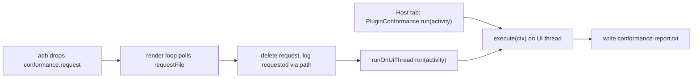

# Diagnostics

**Audience:** operator/developer
**Read this when:** you need to tell what the running client is doing from logcat, read a frame-diagnostic line, or run and interpret the plugin conformance pass.
**Verified against:** `MainActivity.logFrameDiagnostics`, `MainActivity.runRenderLoop`, `android/src/main/java/org/runelite/mobile/host/GraphicsSelfTest.java`, `.../host/PluginConformance.java`, `.../host/RuneLiteHost.java`, `.../host/MobilePluginHub.java`, `.../ClientUpdater.java`

This page is the reference for the port's own instrumentation: what it logs, how to
read it, and how to run the plugin conformance pass. Commands to reach a device
(`adb logcat`, pushing the request file, pulling the report) live in
[device-runbook.md](device-runbook.md); the rendering contract the frame line
describes is in [rendering.md](rendering.md); the plugins being measured are in
[plugin-runtime.md](plugin-runtime.md).

## 0. What logs what

Three independent surfaces emit on their own cadence. Learn which one answers a given
question before reading logcat.

| Surface | Cadence | Answers |
|---|---|---|
| throttled `callbacks.draw:` line | ≤1 per 2 s | is the client drawing, is the blit carrying that content, are overlays landing |
| `GameState:` line | 1 per 5 s | where the client's state machine and camera are, and presentation cost |
| `CONFORMANCE:` + report | on demand | does each plugin's behaviour match its registrations |

All three run on the same device build with no debugger. The boot-time AOT status line
and the one-shot `GFX SELFTEST` are the other two always-on checks (§4, §6, and
[client-updates.md](client-updates.md)).

## 1. Log tags

Every `Log.*` call uses one of three tag literals. Filter on all three at once to see
the port's own output without the rest of the system log.

| Tag | Defined in | Emitted by |
|---|---|---|
| `RuneLiteMobile` | `MainActivity.TAG`, `ClientUpdater.TAG`, `JagexOAuthClient.TAG`, `LocalCallbackServer.TAG`, `SidePanel.TAG` | activity boot, render loop, input, login, updater, panel |
| `RuneLiteHost` | `RuneLiteHost.TAG` (`public static final`) | host bootstrap, plugin lifecycle, `GraphicsSelfTest`, `PluginConformance` (uses `RuneLiteHost.TAG`) |
| `MobilePluginHub` | `MobilePluginHub.TAG`, `OnDeviceDexer.TAG` | hub-jar scanning, import, on-device dexing |

`PluginConformance` deliberately reuses `RuneLiteHost.TAG` rather than defining its
own, so `CONFORMANCE:` lines appear under `RuneLiteHost`.

## 2. The throttled `callbacks.draw` line

`MainActivity.logFrameDiagnostics` runs on every client frame but emits at most one
line per **2 s** (`now - lastDrawLog <= 2000` guard, `MainActivity.java`).
The `n`/`elapsed` in the prefix are counts accumulated since the previous line, so the
reported `fps=` is the average over that window, not an instantaneous rate. The
game-frame fields (`world=`, `px=`, `tr=`, `ovl=`, `iface=`, `entities=`, `yellow=`,
`red=`) are read from the client's own image; `bridge=` is read from the buffer the
render thread presents; `pal=`, `host=`, `blitMs=` are app state.

Prefix:

```text
callbacks.draw: <W>x<H> fps=<n*1000/elapsed> (<n> in <elapsed>ms)
```

| Field | Meaning | How to read it |
|---|---|---|
| `px=<hash>(<len>)` | identity hash + length of the client image's `int[]`, plus six sampled ARGB pixels at fixed offsets | `px=null` means the image exposes no pixel array — the frame never reached the software rasteriser. |
| `world=<nz>/<xor>` | count of non-zero pixels and XOR-fold hash over the client's own frame | A **frozen** `world=` across lines means the client stopped redrawing its 3D scene (see [rendering.md](rendering.md) invariant (a)). |
| `bridge=<nz>/<xor>` | same two metrics over `AWTBridge.activePixels` (what the render thread blits) | A frozen `world=` with a **changing** `bridge=` means the client stopped redrawing; if `world=` and `bridge=` differ, the blit is dropping content. |
| `tr=<xor>` | XOR hash of the top-right strip (≤240 px wide, ≤26 px tall) of the client frame | This is where RuneLite's overlays land; a change here is overlay pixels appearing. |
| `ovl=<n>(<names>)` | `alwaysOnTopOverlayCount` and the overlay class names currently registered | Non-zero proves the plugin runtime registered overlays; the names identify which. |
| `iface=<drawn>/<overlays>` | last interface id passed to `drawInterface` and the overlay count for it | `iface=-1` with `ovl=0` on the login screen is expected — ABOVE_WIDGETS layers need a real interface. |
| `entities=<calls>/<denied>(p=<player> npc=<npc>)` | cumulative `callbacks.draw(Renderable,boolean)` calls, denials, and player/NPC subsets | `denied>0` is a plugin vetoing world actors (e.g. Entity Hider); `calls` not advancing while the client runs is the `entityVeto` failure signature. |
| `yellow=<n>` | count of `0xFFFFFF00` pixels in the top-right strip | RuneLite's FPS overlay paints pure yellow; non-zero proves overlay pixels reached the presented frame. |
| `red=<n>` | count of `0xFFFF0000` pixels in the same strip | Same overlay when it is enforcing a frame limit. |
| `pal=<ok\|BAD>(<nz>/65536)` | whether the three rasteriser palette slots still alias `fq.aq`, and how much of the table is built | `pal=BAD` or a near-zero `nz` means the palette invariant broke — see [rendering.md](rendering.md) invariant (a). |
| `host=<Np\|->` | `RuneLiteHost.activePluginCount()+"p"`, or `-` when the host is not running | Confirms the plugin runtime is up and how many plugins are active. |
| `blitMs=<n.n>` | `lastBlitNanos / 1e6` — time spent inside the `callbacks.draw` frame-blit branch | Watch for growth after a client update; compare with the cost model in [rendering.md](rendering.md). |

**If rendering "stops", check the `callbacks.draw` proxy first.** The render thread
only presents when `frameSeq` changes, and `frameSeq` is incremented only inside the
frame-blit branch of the `Callbacks.draw` proxy (`MainActivity.java`). If
the proxy was never bound, or never enters that branch, the surface keeps showing the
last frame — a static, usually grey screen. On boot, look for
`Callbacks proxy bound (field …)`; the failure string is
`Could not find a Callbacks field on the client class!` (`MainActivity.java`).
A steady stream of `callbacks.draw:` lines in logcat is the positive signal that the
proxy is live; their absence while the client is running is the thing to investigate.

## 3. The 5 s GameState log

Separately from the frame line, `runRenderLoop` logs one line every **5000 ms**
(`now - lastStateLog > 5000`, `MainActivity.java`). It reflects
`net.runelite.api.Client` getters by name; any getter that throws renders `=ERR`
rather than aborting the line. It also reports the presentation cost of the last blit.

Format:

```text
GameState: <state> loginIndex: <idx> scaleMs=<lastScaleNanos/1e6> <probe>=<value> … worldList=<n>
```

| Probe | Notes |
|---|---|
| `getGameState` | the client state machine position (`LOGGED_IN`, `LOGIN_SCREEN`, …) |
| `getLoginIndex` | login sub-screen index |
| `getCurrentLoginField` | focused login field |
| `getBaseX`, `getBaseY` | scene base tile |
| `getPlane` | current plane |
| `getCameraX`, `getCameraY`, `getCameraZ` | camera position; a camera drag (one or two fingers) moves these |
| `getLocalPlayer` | local player object (or `null`) |
| `getMapRegions` | rendered as `N regions` (the array length is substituted, not the array) |
| `getFPS` | the client's own FPS counter |
| `getCanvasWidth`, `getCanvasHeight` | the client canvas size — should stay `765`/`503` |
| `isStretchedEnabled` | stretch mode |
| `getWorldList` | appended last as `worldList=<n>`, or `ERR` |

`scaleMs=` is `lastScaleNanos / 1e6`: the time the render thread spent copying
`appletPixels` into `renderBitmap` on the last pass. Persistently high values point at
the presentation path rather than the client (see [rendering.md](rendering.md)).

## 4. `GraphicsSelfTest`

`host/GraphicsSelfTest.run()` is a one-shot check that the `java.awt` stubs the
overlays draw through actually work on the device. It runs **once per host start**,
from `RuneLiteHost.startPlugins` immediately after hub plugins are loaded
(`RuneLiteHost.java`); it is not re-run by the side panel. On success it logs
`GFX SELFTEST PASS`; a failure logs `GFX SELFTEST FAIL <case>` (unexpected throwable:
`GFX SELFTEST FAIL exception`) and the case name is appended to the host status
string. Cases run in order, and the first failure short-circuits the rest:

| Case | Asserts | Failure strings |
|---|---|---|
| `testFillRect` | an opaque fill lands verbatim; a fill on an alpha-0 frame dest writes RGB but preserves the alpha byte | `fillRect inside=<hex>`, `fillRect bled outside=<hex>`, `frame fill changed alpha: <hex>` |
| `testFrameBlitIsOpaqueCopy` | an opaque source is copied verbatim **including alpha-0 pixels** (the game-frame invariant) | `frame blit dropped an alpha-0 pixel: <hex>`, `frame blit differs at <i>: <hex>` |
| `testAlphaBlend` | an ARGB sprite source-over blends (~0x7F red for 50% black on white) and does not bleed outside | `alpha blend did not draw (pixel unchanged)`, `alpha blend red=<hex> (expected ~0x7F)`, `alpha blend bled outside the sprite` |
| `testText` | `runescape.ttf` loads from the client loader, `FontMetrics.stringWidth` works, and `drawString` paints | `no client loader (host not started)`, `runescape.ttf not readable from the client loader`, `Graphics.getFontMetrics returned null`, `FontMetrics.stringWidth returned <w>`, `drawString painted nothing` |

Because it runs only at host start and only on a release build is it the sole automated
check of the draw surface, its result matters: a `FAIL` on `testText` means overlay
text cannot render, and a `FAIL` on `testFrameBlitIsOpaqueCopy` means the frame-blit
contract is broken. See [core-stubs.md](core-stubs.md) for the graphics semantics
these cases encode.

## 5. Plugin conformance run

`host/PluginConformance.java` drives every loaded plugin through a start/stop cycle and
measures **behaviour**, not just instantiation. It runs single-flight on the UI thread
(`AWTBridge.post`) and ignores a second request while one is in progress, logging
`CONFORMANCE: already running, request ignored`.

### Trigger, paths, and files

Files live in the app-specific external files dir when present, else the internal
files dir (`dir(ctx)`; `PluginConformance.java`). **Use
[device-runbook.md](device-runbook.md) for the exact adb commands** — the request file
is `conformance.request`, the report is `conformance-report.txt`, written next to it in
the same dir.



### Report format

Header, then one line per plugin, then the summary and failure list. The exact header
lines are `# plugin conformance`, `date: <java.util.Date>`, `client:
<RuneLiteHost.clientVersion()>`, `gameState: <state>`, `index: <RuneLiteHost.indexSize()>
classes, loaded: <count>` (`PluginConformance.java`). If the host is not
running the report is `# aborted: host not running (<RuneLiteHost.status()>)` and the
run stops.

Per-plugin line shape (`Result.line()`, `PluginConformance.java`):

```text
<fqcn> <PASS|FAIL|SKIP> enabled=<y|n>/active=<y|n> subs=<reg>/<decl> ovl=<ok>/<bad> cfg=<ok>/<bad> rc=<n> probes=entityVeto(<entities=<n> denied=<n> | note>) [menuEntry(<note>)] [eventFlow(<Name>=<posts>/<subs> …)] [FAILURES=[…] [leak] | SKIP=[…]] [cfgNote=…] [ovlNote=…]
```

Summary and failures:

```text
# summary: plugins=<N> pass=<P> fail=<F> skip=<S>
# failures:
# <fqcn>: <reason>
```

On completion it logs `CONFORMANCE: <summary> (report: <report path>)`; the same
summary is available to the panel through `lastSummary()`.

### Metrics

| Metric | Computed | What it proves |
|---|---|---|
| `subs=<reg>/<decl>` | `<decl>` = one-arg `@Subscribe` methods in the plugin's class hierarchy; `<reg>` = `RuneLiteHost.subscriberCountFor(plugin)`, the real EventBus's count for that object | Mismatch means the plugin's subscribers did not all reach the bus; failure unless the count was unavailable. |
| `ovl=<ok>/<bad>` | every overlay from `RuneLiteHost.overlaysFor(plugin)` rendered into one reused `BufferedImage(512,512,TYPE_INT_ARGB)` on the **client thread**; `ok` = rendered without throw, `bad` = threw while `isLinkError` or while `LOGGED_IN` | `ok` counts renders that completed, even if they drew nothing (`empty=<n>` is reported in `ovlNote`, not failed). |
| `cfg=<ok>/<bad>` | for each zero-arg `@ConfigItem` getter: read, write a different value through `ConfigManager.setConfiguration`, read back, restore | A round-trip proves the config interface and manager are wired; `bad` = getter/write/restore threw or the read-back differed. |
| `rc=<n>` | delta of `RuneLiteHost.renderCallbackCount()` across the plugin's start | Whether the plugin registered any entity-render callbacks at all; `-1` when unavailable. It does **not** prove the callback is ever exercised. |

Unsupported config types are skipped into `cfgNote`; a missing interface or manager
records `no config` / `no config manager` and counts nothing.

### Probes

- **`entityVeto`**. Only meaningful when `rc>0`; if the game is not
  `LOGGED_IN` it notes `skip(<state>)` and skips, and if the client is not dispatching
  events it notes `skip(no events)`. Otherwise it samples `entityDrawCalls()` /
  `entityDrawDenied()` until **100** calls (`ENTITY_PROBE_FRAMES`) or **2500 ms**
  (`ENTITY_PROBE_TIMEOUT_MS`). Zero calls in the window is a **fail**; `denied>0` means
  the plugin vetoed world-actor rendering.
- **`menuEntry`**. Runs only for plugins that subscribe to
  `net.runelite.api.events.MenuEntryAdded`; not logged in ⇒ `skip(<state>)`. On the
  client thread (timeout **1500 ms**, `CLIENT_THREAD_TIMEOUT_MS`) it seeds a synthetic
  entry from the last real menu entry (plugins add options *for a target*), constructs
  `MenuEntryAdded(entry)`, and posts it through the real bus. Outcomes: `modified`,
  `appended N`, or `no-reaction '<option>'`; a genuine error fails, a no-reaction is a
  **skip** (the subscriber is separately proven live by `eventFlow`).
- **`eventFlow`**. Per subscribed event class prints
  `SimpleName=<posts>/<subscriberCount>`. A class with zero posts: if the client is not
  live ⇒ skip; else if it is in `MUST_FIRE_EVENTS` (`[net.runelite.api.events.ClientTick]`)
  ⇒ **fail**; otherwise skip. `GameTick`/`BeforeRender` are deliberately excluded —
  RuneLite's own `Hooks` posts them straight to the bus, so `MainActivity`'s counter
  cannot observe them.

### PASS / FAIL / SKIP rules

- `verdict()` = FAIL if any failure or a leak; else SKIP if any skip; else PASS.
- **A link error always fails**, regardless of game state: `isLinkError` matches (any
  cause in the chain) `NoClassDefFoundError`, `NoSuchMethodError`, `NoSuchFieldError`,
  `AbstractMethodError`, `ClassCastException`, `IncompatibleClassChangeError`,
  `ExceptionInInitializerError`. A throw that is not a link error fails
  only when the game is `LOGGED_IN`; otherwise it is a skip.
- **Leak**: for a plugin that was active at start, stopping it and then
  seeing `subsAfter != subsBefore` or `ovlAfter != ovlBefore` sets `leak` and fails.
- State-dependent probes skip with `skip(<gameState>)` when not `LOGGED_IN`.

At the end, if any config was written the run calls `RuneLiteHost.flushConfig()` so the
restored state is on disk even if the process is force-stopped right after.

### What the counters do *not* prove

The loader counters the Host tab shows — `index=<classes>`, active/live plugin counts,
overlay totals — derive from successful **instantiation**. They say nothing about
behaviour: a plugin can be loaded and "active" while throwing, on every event, a
`NoClassDefFoundError` from a missing transitive dependency, with no counter moving
(this is exactly the case the conformance `subs`/`ovl`/`cfg`/`rc`/probes were added to
catch — see the class javadoc, `PluginConformance.java`). `rc` is likewise a
registration delta; the behavioural number is `entityVeto`'s `entities`/`denied`.
Treat a green loader count as "the class was loaded", never as "the plugin works".

## 6. On-device artifacts

These files are produced and consumed entirely on the device; the full path/producer/
consumer table, the AOT status states, and the adb commands to fetch or push them are
in [device-runbook.md](device-runbook.md).

| Artifact | Purpose | Details |
|---|---|---|
| `files/runelite-dex.jar`, `files/client-version.txt` | installed client + its version | [client-updates.md](client-updates.md) |
| `files/oat/<isa>/runelite-dex.odex` | AOT (speed) compilation of the client dex | [client-updates.md](client-updates.md), [device-runbook.md](device-runbook.md) |
| `files/plugins/`, `<externalFiles>/plugins/` | hub plugin drop boxes | [third-party-plugins.md](third-party-plugins.md) |
| `conformance.request`, `conformance-report.txt` | the pass above | this page, §5 |
| `credentials.properties` | session tokens written by the login flow | [login-and-sessions.md](login-and-sessions.md) |
