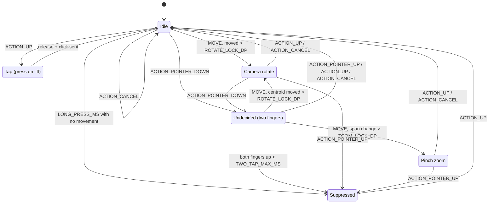

# Input

**Audience:** developer
**Read this when:** you touch `MainActivity.setupTouchInput`, the keyboard bar, the camera/pinch gestures, or need to know why a tap or keystroke is dropped.
**Verified against:** `MainActivity.setupTouchInput`, `MainActivity.handleTwoFingerMove`, `MainActivity.startCameraDrag`, `MainActivity.endCameraDrag`, `MainActivity.toGameX`, `MainActivity.beginTapPress`, `MainActivity.forceCameraDragSetting`, `MainActivity.resolveInputTarget`, `MainActivity.emitPoint`, `MainActivity.dispatchMouseWheel`, `MainActivity.dispatchKeyText`, `MainActivity.deliverKeyEvent`, `MainActivity.buildLauncherUi`, `MainActivity.launchGame`, `SidePanel` (column + `⌨` tile), `java/awt/event/MouseEvent.java`, `java/awt/event/KeyEvent.java`

Touch and keyboard are a **synthesis layer**: Android `MotionEvent`s and `EditText` edits are rebuilt as `java.awt.event` objects and handed to the injected client's own listeners. The client is never modified; it believes it is running on a desktop with a mouse and keyboard. That is why every failure mode in this document is either a coordinate bug, an event-ordering bug, or a missing member in the stub classes documented in [core-stubs.md](core-stubs.md).

## 1. Coordinate mapping

`setupTouchInput` installs one `SurfaceView.OnTouchListener` on `surfaceView` (`MainActivity.setupTouchInput`). It early-returns `true` (consuming everything) whenever `clientInstance == null`, so the launcher UI is not fighting a dead listener.

Surface pixels are mapped into the fixed game space by `toGameX` / `toGameY`:

```java
private int toGameX(float raw) {
    int w = fitW;
    if (w <= 0) return 0;
    int x = (int) ((raw - fitLeft) * GAME_W / w);
    return x < 0 ? 0 : Math.min(x, GAME_W - 1);
}
// toGameY: same with fitH / fitTop / GAME_H
```

`GAME_W` = `765` and `GAME_H` = `503` (`MainActivity` constants). The client is sized once with `clientInstance.setSize(GAME_W, GAME_H)` during bootstrap, so it always renders and hit-tests in the same 765x503 coordinate space regardless of the physical screen.

The mapping is **not** a stretch: the surface is letterboxed to the client's 765:503 aspect (uniform scale, centred, bars painted), and `fitLeft`/`fitTop`/`fitW`/`fitH` are the fit rect computed in `surfaceChanged`. The surface itself is narrower than the screen whenever the right-edge chrome is showing (`applyGameInsets`), so the same rect follows the drawer (see [side-panel.md](side-panel.md)). A point that lands in a bar **clamps** to the nearest game pixel rather than being dropped: a finger that strays into a bar mid-gesture keeps its event stream, which the two-finger camera gesture needs. The blit geometry that scales the 765x503 space into the fit rect is described in [rendering.md](rendering.md).

`wallFor` performs the time half of the same mapping: `MotionEvent` sample times are `uptimeMillis`, so only the offset from the current event is applied to `System.currentTimeMillis()`. The conversion is pure integer arithmetic.

## 2. Single-finger path

Each case dispatches synthesized `MouseEvent`s through `dispatchMouseEvent` / `emitPoint` (section 5). Single-finger mapping:

| `MotionEvent` | AWT events emitted |
|---|---|
| `ACTION_DOWN` | `MOUSE_MOVED` at the touch point **immediately**; `pointerDown=false`; a long press is scheduled (`scheduleLongPress`, `LONG_PRESS_MS`). **No left-button event is sent yet** — the gesture decides which one it is |
| `ACTION_MOVE` (before a press) | `MOUSE_MOVED` for each historical sample then the current point — unless the finger has moved past `ROTATE_LOCK_DP`, which turns the gesture into a camera rotate (section 3) |
| `ACTION_MOVE` (after a press) | `MOUSE_DRAGGED`, same historical-then-current pattern. Only reachable on the lift path (`beginTapPress` sets `pointerDown`), i.e. the drag from the down point to the release point of a tap |
| `ACTION_UP` (tap) | `beginTapPress()` sends `MOUSE_MOVED` + `MOUSE_PRESSED` at the down point, then `MOUSE_DRAGGED` to the release point, `MOUSE_RELEASED` and `MOUSE_CLICKED` |
| `ACTION_UP` (after a long press or a camera drag) | nothing: `suppressUntilUp` / `oneFingerDrag` teardown only |
| `ACTION_CANCEL` | drops the pending long press; releases the middle button if a camera drag was active |

`beginTapPress` re-sends a `MOUSE_MOVED` at `touchDownX/touchDownY` before the `MOUSE_PRESSED`, so the press position and the hover position agree. It is called from `ACTION_UP` only: the press is **deferred** until the gesture has shown what it is (section 3), because the client acts on mouse **down** — an early press would walk or attack before a long-press timer could ever fire.

**Why the MOVED before the PRESSED is load-bearing.** A desktop mouse always moves before it presses, and the client's own menus — the world list in particular — select the row under the **hover** position (`lastMouseX/lastMouseY`), not the position embedded in the press event. Sending a `MOUSE_PRESSED` with no preceding move makes the tap act on wherever the cursor was left by the previous gesture. The explicit `MOUSE_MOVED` at the top of the down handler exists solely to fix that (`MainActivity.setupTouchInput`, comment in the `ACTION_DOWN` case).

Because the press is deferred, a second finger arriving at any time before it is sent (`ACTION_POINTER_DOWN` → `cancelLongPress()`) means no left press is ever emitted for that finger — the two-finger gestures start from a clean button state.

Dragged segments are not a single point. `emitSegment` expands the movement since the last emitted point with `MousePath.expand` (max 8 px steps, capped at 16 fill points) and dispatches every intermediate point, so the client sees a continuous stream instead of teleporting (`MainActivity.emitSegment`). Historical samples from `MotionEvent` are replayed with `wallFor`, which converts `uptimeMillis` sample times back to wall-clock.

## 3. Gestures: one-finger camera drag, two-finger rotate and pinch zoom

**A single finger's gesture is decided by how it moves** (the official mobile client's model). Nothing is emitted at `ACTION_DOWN` except the hover move; the first movement past the rotate threshold picks the camera, and a finger that never moves is a tap or — if it rests — the context menu:

| Condition (view pixels since down) | Result |
|---|---|
| moved > `ROTATE_LOCK_DP` (10 dp), any time | camera rotate: `cancelLongPress()`, `oneFingerDrag = true`, `startCameraDrag(..., "one-finger drag")`; the rest of the gesture emits `MOUSE_DRAGGED` + `BUTTON2` |
| nothing moved for `LONG_PRESS_MS` (400 ms) | **right click**: `fireLongPress` → `emitRightClick` at the published cursor, `suppressUntilUp = true` |
| otherwise | `MOUSE_MOVED` (hover) only; the press is sent on lift by `beginTapPress` |

**There is no time window on the rotate.** An earlier revision required the movement to arrive within 250 ms and turned later movement into a left-button drag (for interface item dragging); that stole slow rotations, because the first `ACTION_MOVE` of a fast drag can arrive after the window — the app's UI thread is busy rendering the game — and it walked the character, since the game acts on mouse *down*. A press is now only ever sent for a tap, on lift, so a drag can neither walk nor attack. The trade-off is explicit: dragging inside an interface rotates the camera instead of dragging an item; items are moved through taps and the client's own menus.

The still hold is free for the menu **because the left press was never sent** — that is the whole reason the press is deferred.

Teardown: `ACTION_UP`/`ACTION_CANCEL` call `endCameraDrag` (middle button up at the current point, `restoreCameraDragSetting()`) and emit **no** left-button event, so a camera drag can never walk or attack; a long press sets `suppressUntilUp` so the lift produces nothing either. `ACTION_POINTER_DOWN` hands a one-finger drag over to the two-finger router (`endCameraDrag` first) and cancels the pending long press.

**Two fingers** do not immediately start a camera drag either: a pinch has to be told apart from a rotation. `ACTION_POINTER_DOWN` only records the gesture's start state (`twoFingerMode = TWO_NONE`, span, centroid, `gestureStartWhen`, `zoomRemainder = 0`), cancels the pending long press and ends a one-finger camera drag; no mouse event is emitted.

`ACTION_MOVE` with two pointers routes through `handleTwoFingerMove`, which locks the mode once and never changes it back within one gesture:

| Undecided → | Condition (view pixels) |
|---|---|
| `TWO_ZOOM` | `abs(span - span0) > ZOOM_LOCK_DP * density` **and** larger than the centroid movement |
| `TWO_ROTATE` | centroid moved more than `ROTATE_LOCK_DP * density` |
| (stays undecided) | neither threshold crossed — nothing is emitted |

| Mode | Emission |
|---|---|
| `TWO_ROTATE` | `startCameraDrag` (below) on the transition, then `MOUSE_DRAGGED` + `BUTTON2` at the two-finger centroid — historical samples first, then the current position (`centroidX` / `centroidY`) |
| `TWO_ZOOM` | `MOUSE_WHEEL` notches: `zoomRemainder += (span - spanLast) / (ZOOM_DP_PER_NOTCH * density)`, whole steps dispatched (clamped to ±`ZOOM_MAX_NOTCHES` per event), never a button press. The rotation is dispatched **negated** (`-steps`) so fingers-apart zooms **in** — verified on the device; the log prints the gesture step, so `pinch zoom +N` means fingers apart |
| still `TWO_NONE` at `ACTION_POINTER_UP` | **two-finger tap → right click**: both fingers down and up within `TWO_TAP_MAX_MS` (400 ms) with neither threshold crossed emits `MOUSE_MOVED` then `BUTTON3` `MOUSE_PRESSED`/`RELEASED`/`CLICKED` at the midpoint of the two fingers (`emitRightClick`), and suppresses the surviving finger |

A two-finger tap produces no left-button event at all (the press is deferred, and `ACTION_POINTER_DOWN` cancels the long press), so the right click is the only click it emits. It is the second route to the context menu, alongside the single-finger long press (section 3): the long press needs a still finger, the two-finger tap is what works while the other hand is busy or when the finger cannot rest.

`ZOOM_DP_PER_NOTCH` = `28f` and `ZOOM_MAX_NOTCHES` = `3` (`MainActivity` constants); `ROTATE_LOCK_DP` = `10f`, `ZOOM_LOCK_DP` = `14f`.

The wheel is the client's own zoom/scroll input: in the world it zooms the camera, with an interface open (bank, chat) it scrolls the list, so one stream covers both halves of "pinch to zoom/scroll". It needs no client-internal field — `dispatchMouseWheel` (section 4) is the same call `ACTION_SCROLL` uses, and the client's own wheel listener accumulates the rotation for the game's input dispatcher.

**The rotation must move the cursor before it presses.** `startCameraDrag(viewX, viewY, when)` emits a `MOUSE_MOVED` (`BUTTON1`) at the centroid and *then* the `MOUSE_PRESSED` (`BUTTON2`), with `lastMouseX/lastMouseY` reset to `-1` first. The client measures its first drag delta against the **published** cursor position (the volatile state its own `mouseMoved` writes, read per tick), which still holds the first finger's position at that moment. Pressing without that move makes the first tick rotate by (centroid - first finger) — the one-time camera jump at the start of a rotation. This is the same class of bug the single-finger path fixes with its `MOUSE_MOVED` before `MOUSE_PRESSED` (section 2).

The middle-button drag is what drives the client's own camera: the client's camera-drag mode rotates yaw and pitch on a `BUTTON2` drag. `forceCameraDragSetting` reflectively loads the client-internal `bn.hc` static flag and forces it `true` for the duration of the gesture, recording the previous value in `forcedCameraSetting` (`forceCameraDragSetting`, `restoreCameraDragSetting`). With the flag false the client treats a middle press as a left click instead of rotating. `bn.hc` is a version-specific obfuscated name and must be re-derived on a client bump — the same class of version coupling described in [telemetry-assessment.md](telemetry-assessment.md).

Gesture teardown (`ACTION_POINTER_UP` / `ACTION_UP` / `ACTION_CANCEL`): the `BUTTON2` `MOUSE_RELEASED` is emitted **only in `TWO_ROTATE`** (at the surviving-finger centroid on `ACTION_POINTER_UP`, `excludeIndex = event.getActionIndex()`), then `restoreCameraDragSetting()` and `twoFingerMode = TWO_NONE`. `ACTION_POINTER_UP` also sets `lastMouseX = -1` and raises `suppressUntilUp = true`.

`suppressUntilUp` is the post-gesture dead zone: while set, `ACTION_DOWN`, `ACTION_MOVE` and `ACTION_POINTER_DOWN` break out immediately. It prevents the finger that remained after `ACTION_POINTER_UP` from being reinterpreted as a fresh single-finger tap as it lifts.

The gesture fields (`MainActivity` fields):

| Field | Meaning |
|---|---|
| `pointerDown` | a left-button press has actually been sent |
| `longPress` | the `Runnable` scheduled by the down handler, cancelled by any movement or second finger |
| `oneFingerDrag` | a single-finger camera drag is in progress |
| `touchDownViewX/Y` | the finger's down point in view pixels (the drag threshold measures from it) |
| `twoFingerMode` | `TWO_NONE` / `TWO_ROTATE` / `TWO_ZOOM` — the decided mode for the gesture in flight |
| `gestureSpan0`, `gestureCx0`, `gestureCy0` | span and centroid at `ACTION_POINTER_DOWN` (the lock thresholds measure against these) |
| `gestureSpanLast`, `zoomRemainder` | span at the previous move, and the sub-notch pinch carry |
| `suppressUntilUp` | ignore input until the current finger lifts |

Their transitions, with the events that drive them:



`Idle` corresponds to `pointerDown == false && !oneFingerDrag && twoFingerMode == TWO_NONE && !suppressUntilUp`; `Tap` is the `ACTION_UP` path that calls `beginTapPress` (momentary — `pointerDown` becomes true inside it and is cleared at the end of the case); `Undecided`/`Zoom` are `twoFingerMode` values and `Rotate` is `twoFingerMode == TWO_ROTATE || oneFingerDrag`; `Suppressed` is `suppressUntilUp == true`, set by the long press and by a two-finger tap. There is no "pending press" state any more: the left press is not scheduled, it is sent on lift.

## 4. Scroll

```java
int rotation = -(int) Math.round(event.getAxisValue(MotionEvent.AXIS_VSCROLL));
if (rotation != 0) dispatchMouseWheel(toGameX(event.getX()), toGameY(event.getY()), rotation, when);
```

The negation converts Android's positive-down `AXIS_VSCROLL` into AWT's wheel rotation sign. A zero rotation is dropped before dispatch. `dispatchMouseWheel` builds a `MouseWheelEvent(target, MOUSE_WHEEL, when, 0, x, y, 1, false, WHEEL_UNIT_SCROLL, 3, rotation)` — unit scroll, amount 3 — and delivers it to `getMouseWheelListeners()`; the null-target guard is `resolveInputTarget`, which returns null when the client is not running (`MainActivity.dispatchMouseWheel`).

## 5. Dispatch target and event construction

`resolveInputTarget` prefers the client component itself: if `clientInstance` has any mouse, mouse-motion or mouse-wheel listeners, it is returned. Otherwise it loads `net.runelite.api.GameEngine`, calls `getCanvas()`, and returns that if it is a `java.awt.Component`. If both fail it falls back to `clientInstance` (`MainActivity.resolveInputTarget`). The game attaches its listeners to the canvas, but other setups attach to the component, which is why both are probed.

`emitPoint` constructs every mouse event with the same shape (`MainActivity.emitPoint`):

```java
new java.awt.event.MouseEvent(target, id, when, 0, x, y, 1, false, button)
```

That is `MouseEvent(Component,int,long,int,int,int,int,boolean,int)`: modifiers `0`, click count `1`, popup trigger `false`, and the caller's button (`BUTTON1` for touch, `BUTTON2` for camera). `MOUSE_MOVED` and `MOUSE_DRAGGED` go to `getMouseMotionListeners()`; the press/release/click ids go to `getMouseListeners()`; a listener throw is caught and logged (`emitPoint failed`) so it cannot unwind the input thread.

`dispatchMouseEvent` is the wrapper used by the touch handler. It resolves the target, logs `Dispatch mouse id=<id> at (x,y) to <Class>` for every id except `MOUSE_MOVED`, and on `MOUSE_PRESSED` it logs the listener counts, dumps the mouse state, and starts the 1 s `LoginTick` diagnostic (`MainActivity.dispatchMouseEvent`). Finally it forwards to `emitPoint` with `BUTTON1`.

## 6. Keyboard bridge

The game has **no in-game text input**. There is no IME hook inside the client; instead a floating bar injects AWT `KeyEvent`s into the same listeners the mouse path uses.

| Widget | Detail |
|---|---|
| `⌨` tile | `TextView` at the foot of the side panel's right-edge column (`SidePanel`); its click calls `Listener.onKeyboardToggleRequested` → `toggleKeyboardBar`. The column is hidden on the launcher screen, so the tile appears exactly while the game runs |
| `kbBar` | horizontal `LinearLayout`, `GONE` initially, added top-centre; holds the `EditText` plus `Enter` and `Hide` pills. It is anchored to the **top** on purpose: with the soft keyboard up (Gboard takes the bottom half in landscape) a bottom-anchored bar is covered, and so is the game's own chat input line — the typed text and the `Enter`/`Hide` buttons would all be unreachable |
| `kbEdit` | `EditText`, single-line, hint `Type here...`, `IME_ACTION_GO`; the editor action dispatches `VK_ENTER` |
| `Enter` / `Hide` | `dispatchKeyCode(VK_ENTER, '\n')` / `toggleKeyboardBar()` |

`toggleKeyboardBar` flips `kbBar` visibility and shows/hides the soft keyboard via `InputMethodManager` (`MainActivity.toggleKeyboardBar`). The bar is inset by the right-edge chrome width like the game surface (`applyGameInsets`), so it centres over the game area rather than under the drawer column.

`kbEdit` is **not** `TYPE_TEXT_VARIATION_VISIBLE_PASSWORD`: Gboard treats a password field as one it must take over in landscape (its fullscreen "extract" editor), which covers the app entirely. `TYPE_TEXT_FLAG_NO_SUGGESTIONS` + `IME_FLAG_NO_PERSONALIZED_LEARNING` + `IME_FLAG_NO_EXTRACT_UI` keep the other half of that variation's behaviour (no autocorrect, no learned words) without the takeover.

Text is diffed, not echoed wholesale. A `TextWatcher` computes the common prefix `pf` and common suffix `sf` between `kbPrevText` and the new text, derives `removed = oldLen - pf - sf` and `added = newText.substring(pf, newLen - sf)`, emits one `dispatchKeyCode(VK_BACK_SPACE, '\b')` per removed character, then `dispatchKeyText(added)` (`buildLauncherUi`, `afterTextChanged`). This turns arbitrary `EditText` edits (paste, selection replace) into a minimal stream of key events.

`dispatchKeyText` emits, for each character, `KEY_PRESSED` + `KEY_TYPED` + `KEY_RELEASED`; the key code is the upper-case `VK` value for letters (`c - 32` for `a`–`z`) and the character itself otherwise (`MainActivity.dispatchKeyText`). `dispatchKeyCode` does the same three-event sequence for a single `(keyCode, keyChar)` pair, used for `VK_ENTER` and `VK_BACK_SPACE` (`MainActivity.dispatchKeyCode`).

`deliverKeyEvent` constructs one `KeyEvent(target, id, when, 0, keyCode, keyChar)` and walks `getKeyListeners()` on the resolved target **and** on `GameEngine.getCanvas()` when the canvas differs from the target (`MainActivity.deliverKeyEvent`). Both are tried because the game registers key listeners on the canvas while RuneLite-side listeners may sit on the component.

## 7. The stub dependency

Every event above is a `java.awt.event` object built by the port's own stubs. If a member the client touches is missing, the client's listener throws. The mouse path wraps dispatch in `catch (Throwable)` (`emitPoint`, `dispatchMouseEvent`), so a missing member shows up as a logged failure rather than a crash; the keyboard path (`dispatchKeyText`, `deliverKeyEvent`) has no such guard and a missing `KeyEvent` member surfaces as an uncaught error. In both cases the visible symptom is a **silent drop**: taps do nothing, typing does nothing.

The load-bearing members for input are (see [core-stubs.md](core-stubs.md)):

| Member | Used for |
|---|---|
| `MouseEvent.getPoint()`, `MouseEvent.getComponent()` | client menu/hit-test code reading the event |
| `InputEvent.getModifiersEx()`, `InputEvent.getModifiersExText(int)` | modifier state and its display form |
| `KeyEvent.getKeyText(int)`, `getExtendedKeyCode()`, `setKeyCode`, `setKeyChar`, `paramString()` | client key handling and diagnostics |
| `AWTEvent(Object,int)` constructor | runtime-critical super constructor |

The `Throwable` catch in `dispatchMouseEvent` happens **after** the `Dispatch mouse id=501 …` log line, because that log is emitted before the event is built. A logcat that shows `Dispatch mouse id=501` immediately followed by `dispatchMouseEvent failed` therefore means the event never reached a listener; if it shows nothing at all, the touch handler is not running (`clientInstance == null`). See [troubleshooting.md](troubleshooting.md) for the symptom → cause table.

## 8. Touch ownership and view layering

The drawer, its column and the keyboard bar consume only events inside their own bounds; the game surface is *inset* rather than covered (`applyGameInsets`), so no tap is lost. The order in which children are added to `rootLayout` decides what draws over what:

1. `surfaceView` — the game surface, added first (bottom).
2. `launcherScroll` — the launcher panel (scrim + centred card).
3. `bootOverlay` — the themed "Starting RuneLite…" card, hidden on the first presented frame.
4. `kbBar` — the keyboard bar, top-centre.
5. the `SidePanel` container, created by `new SidePanel(this, rootLayout)` (its column and drawer are added during construction) — so the column and drawer draw over the boot overlay.
6. `loginOverlay` — added **last**, so the login overlay covers the drawer and every other control while a login is in progress.

Removing the launcher (`launchGame`) only sets `launcherScroll` to `GONE`; it does not remove it, so the add order is fixed for the Activity's lifetime. The column and the drawer are hidden as a unit by `SidePanel.setAvailable(false)` on the launcher screen.
