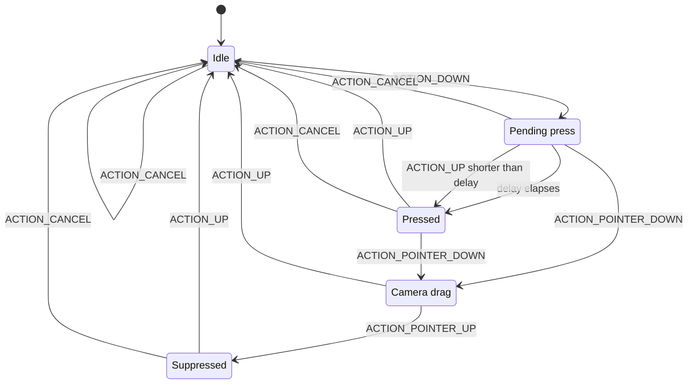

# Input

**Audience:** developer
**Read this when:** you touch `MainActivity.setupTouchInput`, the floating `KB` bar, or need to know why a tap or keystroke is dropped.
**Verified against:** `MainActivity.setupTouchInput`, `MainActivity.toGameX`, `MainActivity.beginTapPress`, `MainActivity.forceCameraDragSetting`, `MainActivity.resolveInputTarget`, `MainActivity.emitPoint`, `MainActivity.dispatchMouseWheel`, `MainActivity.dispatchKeyText`, `MainActivity.deliverKeyEvent`, `MainActivity.buildLauncherUi`, `MainActivity.launchGame`, `java/awt/event/MouseEvent.java`, `java/awt/event/KeyEvent.java`

Touch and keyboard are a **synthesis layer**: Android `MotionEvent`s and `EditText` edits are rebuilt as `java.awt.event` objects and handed to the injected client's own listeners. The client is never modified; it believes it is running on a desktop with a mouse and keyboard. That is why every failure mode in this document is either a coordinate bug, an event-ordering bug, or a missing member in the stub classes documented in [core-stubs.md](core-stubs.md).

## 1. Coordinate mapping

`setupTouchInput` installs one `SurfaceView.OnTouchListener` on `surfaceView` (`MainActivity.setupTouchInput`). It early-returns `true` (consuming everything) whenever `clientInstance == null`, so the launcher UI is not fighting a dead listener.

Surface pixels are mapped into the fixed game space by `toGameX` / `toGameY`:

```java
private int toGameX(android.view.View v, float raw) { return (int)(raw * GAME_W / v.getWidth()); }
private int toGameY(android.view.View v, float raw) { return (int)(raw * GAME_H / v.getHeight()); }
```

`GAME_W` = `765` and `GAME_H` = `503` (`MainActivity` constants). The client is sized once with `clientInstance.setSize(GAME_W, GAME_H)` during bootstrap, so it always renders and hit-tests in the same 765x503 coordinate space regardless of the physical screen. The blit geometry that scales that space up to the surface is described in [rendering.md](rendering.md).

The conversion uses the view's own `getWidth()` / `getHeight()`, not the surface dimensions, so it stays correct however the surface is laid out. `wallFor` performs the time half of the same mapping: `MotionEvent` sample times are `uptimeMillis`, so only the offset from the current event is applied to `System.currentTimeMillis()`. Both are pure integer arithmetic; there is no aspect-ratio letterboxing, because the client frame is stretched to fill the surface (see [rendering.md](rendering.md)).

## 2. Single-finger path

Each case dispatches synthesized `MouseEvent`s through `dispatchMouseEvent` / `emitPoint` (section 5). Single-finger mapping:

| `MotionEvent` | AWT events emitted |
|---|---|
| `ACTION_DOWN` | `MOUSE_MOVED` at the touch point **immediately**; `pointerDown=false`; the `MOUSE_PRESSED` is scheduled `TAP_PRESS_DELAY_MS` later via `surfaceView.postDelayed(pendingPress, TAP_PRESS_DELAY_MS)` |
| `ACTION_MOVE` (down) | `MOUSE_DRAGGED` for each historical sample then the current point |
| `ACTION_MOVE` (not down) | `MOUSE_MOVED`, same historical-then-current pattern |
| `ACTION_UP` (tap shorter than the delay) | `beginTapPress()` sends `MOUSE_MOVED` + `MOUSE_PRESSED`, then `MOUSE_RELEASED` and `MOUSE_CLICKED` |
| `ACTION_UP` (long press already sent) | `MOUSE_RELEASED` + `MOUSE_CLICKED` |
| `ACTION_CANCEL` | drops the pending press; releases the middle button if a camera drag was active |

`TAP_PRESS_DELAY_MS` is `120L` (`MainActivity` constants). `beginTapPress` re-sends a `MOUSE_MOVED` at `touchDownX/touchDownY` before the `MOUSE_PRESSED`, so the press position and the hover position agree.

**Why the MOVED before the PRESSED is load-bearing.** A desktop mouse always moves before it presses, and the client's own menus — the world list in particular — select the row under the **hover** position (`lastMouseX/lastMouseY`), not the position embedded in the press event. Sending a `MOUSE_PRESSED` with no preceding move makes the tap act on wherever the cursor was left by the previous gesture. The explicit `MOUSE_MOVED` at the top of the down handler exists solely to fix that (`MainActivity.setupTouchInput`, comment in the `ACTION_DOWN` case).

The delay also lets a second finger arrive before any left-button event is sent: if `ACTION_POINTER_DOWN` arrives within `TAP_PRESS_DELAY_MS`, `cancelPendingPress()` removes the scheduled runnable and no left press is ever emitted for that finger.

Dragged segments are not a single point. `emitSegment` expands the movement since the last emitted point with `MousePath.expand` (max 8 px steps, capped at 16 fill points) and dispatches every intermediate point, so the client sees a continuous stream instead of teleporting (`MainActivity.emitSegment`). Historical samples from `MotionEvent` are replayed with `wallFor`, which converts `uptimeMillis` sample times back to wall-clock.

## 3. Two-finger camera drag

`ACTION_POINTER_DOWN` begins a camera gesture:

| Step | Behaviour |
|---|---|
| cancel | `cancelPendingPress()` drops the held-off single-finger press |
| left-button cleanup | if `pointerDown`, emit `MOUSE_RELEASED` and clear `pointerDown` |
| begin drag | if `!cameraDrag`, set `cameraDrag=true`, call `forceCameraDragSetting()`, emit `MOUSE_PRESSED` with `BUTTON2` at the two-finger centroid |

While `cameraDrag` is true, `ACTION_MOVE` emits `MOUSE_DRAGGED` with `BUTTON2` at the centroid of up to the first two pointers — historical samples first, then the current position (`centroidX` / `centroidY`). `ACTION_POINTER_UP` emits a `BUTTON2` `MOUSE_RELEASED` at the surviving-finger centroid (`excludeIndex = event.getActionIndex()`), calls `restoreCameraDragSetting()`, clears `cameraDrag`, sets `lastMouseX = -1`, and raises `suppressUntilUp = true`. `ACTION_UP` while dragging emits the release at the full centroid, restores the setting, and clears `suppressUntilUp`.

The middle-button drag is what drives the client's own camera: the client's camera-drag mode rotates yaw and pitch on a `BUTTON2` drag. `forceCameraDragSetting` reflectively loads the client-internal `bn.hc` static flag and forces it `true` for the duration of the gesture, recording the previous value in `forcedCameraSetting` (`forceCameraDragSetting`, `restoreCameraDragSetting`). With the flag false the client treats a middle press as a left click instead of rotating. `bn.hc` is a version-specific obfuscated name and must be re-derived on a client bump — the same class of version coupling described in [telemetry-assessment.md](telemetry-assessment.md).

`suppressUntilUp` is the post-gesture dead zone: while set, `ACTION_DOWN`, `ACTION_MOVE` and `ACTION_POINTER_DOWN` break out immediately. It prevents the finger that remained after `ACTION_POINTER_UP` from being reinterpreted as a fresh single-finger tap as it lifts.

The four fields that encode gesture state (`MainActivity` fields):

| Field | Meaning |
|---|---|
| `pointerDown` | a left-button press has actually been sent |
| `pendingPress` | the `Runnable` scheduled by the down handler, not yet run |
| `cameraDrag` | a two-finger middle-button drag is in progress |
| `suppressUntilUp` | ignore input until the current finger lifts |

Their transitions, with the events that drive them:



`Idle` corresponds to `pointerDown == false && cameraDrag == false && pendingPress == null && !suppressUntilUp`; `Pending` to `pendingPress != null`; `Pressed` to `pointerDown == true`; `Camera` to `cameraDrag == true`; `Suppressed` to `suppressUntilUp == true`.

## 4. Scroll

```java
int rotation = -(int) Math.round(event.getAxisValue(MotionEvent.AXIS_VSCROLL));
if (rotation != 0) dispatchMouseWheel(toGameX(v, event.getX()), toGameY(v, event.getY()), rotation, when);
```

The negation converts Android's positive-down `AXIS_VSCROLL` into AWT's wheel rotation sign. A zero rotation is dropped before dispatch. `dispatchMouseWheel` builds a `MouseWheelEvent(target, MOUSE_WHEEL, when, 0, x, y, 1, false, WHEEL_UNIT_SCROLL, 3, rotation)` — unit scroll, amount 3 — and delivers it to `getMouseWheelListeners()`; the null-target guard is `resolveInputTarget`, which returns null when the client is not running (`MainActivity.dispatchMouseWheel`).

## 5. Dispatch target and event construction

`resolveInputTarget` prefers the client component itself: if `clientInstance` has any mouse, mouse-motion or mouse-wheel listeners, it is returned. Otherwise it loads `net.runelite.api.GameEngine`, calls `getCanvas()`, and returns that if it is a `java.awt.Component`. If both fail it falls back to `clientInstance` (`MainActivity.resolveInputTarget`). The game attaches its listeners to the canvas, but other setups attach to the component, which is why both are probed.

`emitPoint` constructs every mouse event with the same shape (`MainActivity.emitPoint`):

```java
new java.awt.event.MouseEvent(target, id, when, 0, x, y, 1, false, button)
```

That is `MouseEvent(Component,int,long,int,int,int,int,boolean,int)`: modifiers `0`, click count `1`, popup trigger `false`, and the caller's button (`BUTTON1` for touch, `BUTTON2` for camera). `MOUSE_MOVED` and `MOUSE_DRAGGED` go to `getMouseMotionListeners()`; the press/release/click ids go to `getMouseListeners()`; a listener throw is caught and logged (`emitPoint failed`) so it cannot unwind the input thread.

`dispatchMouseEvent` is the wrapper used by the touch handler. It resolves the target, logs `Dispatch mouse id=<id> at (x,y) to <Class>` for every id except `MOUSE_MOVED`, and on `MOUSE_PRESSED` it logs the listener counts, dumps the mouse state, and starts the 1 s `LoginTick` diagnostic (`MainActivity.dispatchMouseEvent`). Finally it forwards to `emitPoint` with `BUTTON1`.

## 6. Keyboard bridge

The game has **no in-game text input**. There is no IME hook inside the client; instead a floating bar injects AWT `KeyEvent`s into the same listeners the mouse path uses.

| Widget | Detail |
|---|---|
| `KB` button | `Button` labelled `KB`, hidden (`GONE`) at construction (`buildLauncherUi`); made visible by `launchGame` and hidden again if bootstrap fails. Clicking toggles the bar |
| `kbBar` | horizontal `LinearLayout`, `GONE` initially, added bottom-centre; holds the `EditText` plus `Enter` and `Hide` buttons |
| `kbEdit` | `EditText`, single-line, hint `Type here...`, `IME_ACTION_GO`; the editor action dispatches `VK_ENTER` |
| `Enter` / `Hide` | `dispatchKeyCode(VK_ENTER, '\n')` / `toggleKeyboardBar()` |

`toggleKeyboardBar` flips `kbBar` visibility and shows/hides the soft keyboard via `InputMethodManager` (`MainActivity.toggleKeyboardBar`).

Text is diffed, not echoed wholesale. A `TextWatcher` computes the common prefix `pf` and common suffix `sf` between `kbPrevText` and the new text, derives `removed = oldLen - pf - sf` and `added = newText.substring(pf, newLen - sf)`, emits one `dispatchKeyCode(VK_BACK_SPACE, '\b')` per removed character, then `dispatchKeyText(added)` (`buildLauncherUi`, `afterTextChanged`). This turns arbitrary `EditText` edits (paste, selection replace) into a minimal stream of key events.

`dispatchKeyText` emits, for each character, `KEY_PRESSED` + `KEY_TYPED` + `KEY_RELEASED`; the key code is the upper-case `VK` value for letters (`c - 32` for `a`–`z`) and the character itself otherwise (`MainActivity.dispatchKeyText`). `dispatchKeyCode` does the same three-event sequence for a single `(keyCode, keyChar)` pair, used for `VK_ENTER` and `VK_BACK_SPACE` (`MainActivity.dispatchKeyCode`).

`deliverKeyEvent` constructs one `KeyEvent(target, id, when, 0, keyCode, keyChar)` and walks `getKeyListeners()` on the resolved target **and** on `GameEngine.getCanvas()` when the canvas differs from the target (`MainActivity.deliverKeyEvent`). Both are tried because the game registers key listeners on the canvas while RuneLite-side listeners may sit on the component.

## 7. The stub dependency

Every event above is a `java.awt.event` object built by the port's own stubs. If a member the client touches is missing, the client's listener throws. The mouse path wraps dispatch in `catch (Throwable)` (`emitPoint`, `dispatchMouseEvent`), so a missing member shows up as a logged failure rather than a crash; the keyboard path (`dispatchKeyText`, `deliverKeyEvent`) has no such guard and a missing `KeyEvent` member surfaces as an uncaught error. In both cases the visible symptom is a **silent drop**: taps do nothing, typing does nothing.

The load-bearing members for input are (see [core-stubs.md](core-stubs.md)):

| Member | Used for |
|---|---|
| `MouseEvent.getPoint()`, `MouseEvent.getComponent()` | client menu/hit-test code reading the event |
| `InputEvent.getModifiersEx()`, `InputEvent.getModifiersExText(int)` | modifier state and its display form |
| `KeyEvent.getKeyText(int)`, `getExtendedKeyCode()`, `setKeyCode`, `setKeyChar`, `paramString()` | client key handling and diagnostics |
| `AWTEvent(Object,int)` constructor | runtime-critical super constructor |

The `Throwable` catch in `dispatchMouseEvent` happens **after** the `Dispatch mouse id=501 …` log line, because that log is emitted before the event is built. A logcat that shows `Dispatch mouse id=501` immediately followed by `dispatchMouseEvent failed` therefore means the event never reached a listener; if it shows nothing at all, the touch handler is not running (`clientInstance == null`). See [troubleshooting.md](troubleshooting.md) for the symptom → cause table.

## 8. Touch ownership and view layering

The drawer and the keyboard bar consume only events inside their own bounds; the game surface keeps its full size underneath, so game input elsewhere is unaffected (`buildLauncherUi`, comment above the `SidePanel` construction). This works because of the order in which children are added to `rootLayout`:

1. `surfaceView` — the game surface, added first (bottom).
2. `launcherScroll` — the launcher panel.
3. `btnSettings`, `btnPanel` (panel toggle), `kbButton` — floating buttons.
4. the `SidePanel` container, created by `new SidePanel(this, rootLayout, GAME_W)` (its own views are added during construction).
5. `kbBar` — the floating keyboard bar.
6. `loginOverlay` — added **last**, so the login overlay covers the drawer and every other control while a login is in progress.

Removing the launcher (`launchGame`) only sets `launcherScroll` to `GONE`; it does not remove it, so the add order is fixed for the Activity's lifetime.
