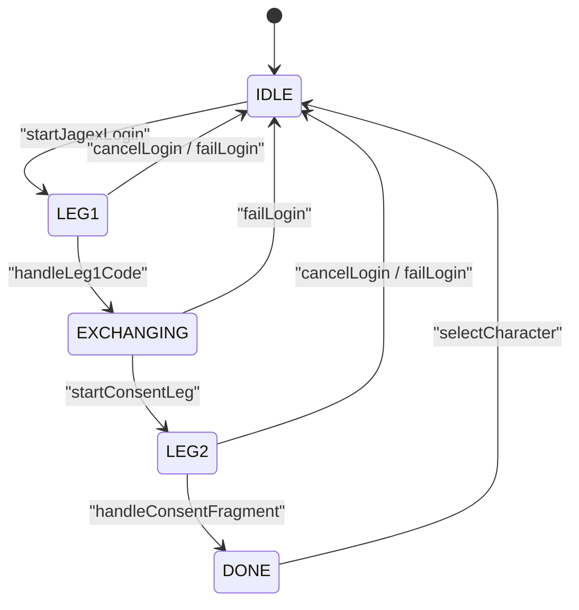

# Login and sessions

**Audience:** developer
**Read this when:** you touch Jagex account login, session tokens, the local OAuth callback, or the client's `JX_*` launch contract
**Verified against:** `MainActivity.startJagexLogin`, `MainActivity.onNewIntent`, `MainActivity.handleLeg1Code`, `MainActivity.handleConsentFragment`, `MainActivity.bootstrapGameClient`, `JagexOAuthClient.java`, `LocalCallbackServer.java`, `AndroidManifest.xml`, `xml/network_security_config.xml`

The port does not implement authentication. It runs the two-leg OAuth flow that the official
Jagex Launcher performs, then hands the resulting **game session** to the unmodified client as
`JX_*` tokens, exactly as the desktop launcher does.

## 1. Overview: two OAuth legs in the external browser

Both legs happen in the **device's external browser**, opened with `Intent.ACTION_VIEW`
(`MainActivity.openInBrowser`). There is no embedded `WebView` in the login path: Jagex's
Cloudflare bot protection rejects the `Android WebView` UA-CH runtime, which no WebView API can
mask, so an external browser is required (comment above `MainActivity.startJagexLogin`). The
comment at `MainActivity:264` that still says "login WebView overlay" is stale.

| Leg | Client | Purpose | How the result returns |
|---|---|---|---|
| 1 | launcher client `com_jagex_auth_desktop_launcher` | authorize + PKCE → `code` → exchange for tokens; read `login_provider` | redirect intent: `MainActivity.onNewIntent` |
| 2 | consent client `1fddee4e-b100-4f4e-b2b0-097f9088f9d2` | authorize → `id_token` in the URL fragment | loopback HTTP server `LocalCallbackServer` |

`MainActivity` is `android:launchMode="singleTask"` with two `ACTION_VIEW` intent filters
(`AndroidManifest.xml`): scheme `https` + host `secure.runescape.com` +
`pathPrefix="/m=weblogin/launcher-redirect"`, and scheme `jagex`. Because the activity is a
singleton, both redirects are delivered to the already-running instance through `onNewIntent`,
not through a new activity.

`LoginStage` is a private enum in `MainActivity` (`IDLE, LEG1, LEG2, EXCHANGING, DONE`) guarded
throughout by the `loginActive` flag.



Out-of-stage redirects are dropped, not queued: `onNewIntent` only accepts a launcher redirect
while `loginStage == LEG1` (`MainActivity.onNewIntent`), `handleLeg1Redirect`/`handleLeg1Code`
re-check `LEG1`, and `handleConsentFragment` requires `LEG2`. A second intent arriving during
`EXCHANGING` is therefore ignored.

## 2. Leg 1: launcher client

All literals live in `JagexOAuthClient`:

| Constant | Value |
|---|---|
| `AUTHORIZE_ENDPOINT` | `https://account.jagex.com/oauth2/auth` |
| `TOKEN_ENDPOINT` | `https://account.jagex.com/oauth2/token` |
| `LAUNCHER_CLIENT_ID` | `com_jagex_auth_desktop_launcher` |
| `LAUNCHER_REDIRECT_URI` | `https://secure.runescape.com/m=weblogin/launcher-redirect` |
| `LAUNCHER_SCOPE` | `openid offline gamesso.token.create user.profile.read` |

`buildLauncherAuthorizeUrl` builds the authorize URL with `response_type=code`, `prompt=login`,
and PKCE (`JagexOAuthClient.buildAuthorizeUrl`). PKCE is S256:

- Verifier = `generateVerifier()`: 64 bytes from a static `SecureRandom`, base64url-encoded
  without padding (`Base64.getUrlEncoder().withoutPadding()`).
- Challenge = `createChallenge(verifier)`: SHA-256 over the verifier's **US-ASCII** bytes,
  base64url-encoded.
- The URL carries `code_challenge` and `code_challenge_method=S256`.

`state` and `nonce` are each `randomToken(16)` (16 random bytes). `MainActivity` generates them
for both legs; **only leg 2's `state` is validated on return** — leg 1 checks neither `state`
nor `nonce`, and leg 2's `nonce` is sent but never checked.

The `code` comes back one of two ways:

- `jagex:` scheme → `handleLeg1Scheme` strips the scheme and parses `code=...&state=...`
  (splits on `[,&]`, URL-decodes each value).
- the https launcher redirect → `handleLeg1Redirect` → `parseUrlParam(url, "code")`.

Both funnel into `handleLeg1Code`, which moves the state to `EXCHANGING` and exchanges the code
on a `JagexTokenExchange` thread via `JagexOAuthClient.exchangeCode`. The token POST is
`application/x-www-form-urlencoded` with `grant_type=authorization_code`, `code`, `redirect_uri`,
`client_id`, `code_verifier`; parameters are URL-encoded with `+` rewritten to `%20`.

Response parsing (`postTokenForm`) reads `access_token` (default `""`), `refresh_token`/`id_token`
(default `null`), and `expires_in` (default `0`; `expiresAtMillis = now + expires_in*1000` only
when positive). It throws if `access_token` is empty or `id_token` is null. All three HTTP calls
use a **15 s connect / 30 s read** timeout, and any error body is truncated to **300 chars**
(`truncate`) before being embedded in the `IOException` message.

`loginProvider(idToken)` splits the JWT on `.` and base64url-decodes the payload segment to read
the `login_provider` claim (see §7).

## 3. Leg 2: consent client

`startConsentLeg` sets `LEG2`, generates a fresh `state`/`nonce` (16 bytes each), and builds the
consent authorize URL:

| Constant | Value |
|---|---|
| `CONSENT_CLIENT_ID` | `1fddee4e-b100-4f4e-b2b0-097f9088f9d2` |
| `CONSENT_REDIRECT_URI` | `http://localhost` |
| scope | `openid offline` |
| `response_type` | `id_token code` |

`buildConsentAuthorizeUrl` passes `codeChallenge = null` and `prompt = null`, so this leg carries
**no PKCE** and no `prompt`. The redirect is exactly `http://localhost` (port 80, no path).

On return, `handleConsentFragment` validates `state` against `leg2State` (mismatch →
`failLogin("Login failed: consent state mismatch. Try again.")`), extracts `id_token`, sets
`DONE`, and creates the game session on a `JagexSession` thread. `nonce` is not validated, and
the `code` half of `response_type=id_token code` is never consumed — only `id_token` is used.

## 4. `LocalCallbackServer`: why a loopback server

The consent redirect is `http://localhost`, and the `id_token` arrives in the URL **fragment**.
A browser navigation never sends a fragment to a server, so interception alone cannot see it. The
app therefore runs a tiny HTTP server on loopback:

```text
browser → http://localhost/#id_token=...&code=...&state=...
        → page JS: fetch('/', {method:'POST', body: location.hash.slice(1)})
        → LocalCallbackServer POST handler → MainActivity.handleConsentFragment
```

The served page (`LocalCallbackServer.PAGE`) runs exactly that `fetch` and then replaces the body
with "Login complete. Return to RuneLite Mobile.".

Server behaviour (`LocalCallbackServer`):

- `start()` binds `127.0.0.1:80` and `[::1]:80` with backlog 4, and returns true if **any**
  address bound. Binding port 80 on loopback needs no root.
- One daemon accept thread per bound address, named `LoginCallback-<addr>`.
- Accepted connections from non-loopback peers are rejected via `isLoopbackAddress()`.
- Socket read timeout is 8000 ms. `readRequest` parses HTTP/1.x headers byte-wise up to a blank
  line, honours case-insensitive `Content-Length`, refuses headers over 65536 bytes, and reads
  exactly the body length.
- A GET (no body) serves `PAGE`; a POST with a body is **one-shot**: set `delivered`, log
  `[5/6] Consent callback POST received (len=…)`, answer `OK`, `stop()` the server, then invoke
  `listener.onConsentFragment(fragment)`.

`MainActivity.startCallbackServer` wraps the listener in `runOnUiThread`, so the fragment is
parsed on the UI thread. The server is started **before leg 1** (`startJagexLogin` starts it, then
opens the leg-1 browser), so it is running during both legs, but it only ever receives the leg-2
consent callback. It is stopped on `cancelLogin`, on `onDestroy`, and by itself after the single
POST. If binding fails, `startJagexLogin` calls `failLogin("Login failed: could not start the
local login callback.")` and leg 1 never opens.

The token is delivered by **this server**, not by any intercepted WebView navigation. There is no
`shouldOverrideUrlLoading` in the tree.

## 5. Game session exchange

`handleConsentFragment` passes the `id_token` to `JagexOAuthClient` on the `JagexSession` thread:

| Step | Call | Result |
|---|---|---|
| create session | `POST https://auth.jagex.com/game-session/v1/sessions` body `{"idToken":"…"}` | `sessionId` (throws if missing) |
| list accounts | `GET https://auth.jagex.com/game-session/v1/accounts`, `Authorization: Bearer <sessionId>` | JSON array of `{accountId, displayName}` |

Both calls use the same 15 s connect / 30 s read timeouts and 300-char error truncation. The
sessions body is built by string concatenation with `escapeJson` escaping only backslash and
quote. Accounts with an empty `accountId` are skipped; the login succeeds only if at least one
account remains.

The endpoint returns `accountId`; there is no separate `characterId`. `MainActivity.selectCharacter`
stores `sessionId` in the session slot and `account.accountId` in the **character id** slot.

## 6. Session wiring into the client

`bootstrapGameClient` applies the session **only** when `signedIn && !sessionId.isEmpty()`
(`MainActivity.bootstrapGameClient`):

```java
android.system.Os.setenv("JX_SESSION_ID", sessionId, true);
android.system.Os.setenv("JX_CHARACTER_ID", characterId, true);
android.system.Os.setenv("JX_DISPLAY_NAME", displayName, true);
System.setProperty("JX_SESSION_ID", sessionId);
System.setProperty("JX_CHARACTER_ID", characterId);
System.setProperty("JX_DISPLAY_NAME", displayName);
android.system.Os.unsetenv("JX_ACCESS_TOKEN");
android.system.Os.unsetenv("JX_REFRESH_TOKEN");
```

`Os.setenv(..., true)` updates the native environment that `System.getenv()` re-reads; the
`System.setProperty` mirror covers code that reads properties. The `JX_ACCESS_TOKEN` /
`JX_REFRESH_TOKEN` vars are **actively unset**: the client takes a different (wrong) login branch
if they are present alongside the session vars. This contract is documented at the top of
`JagexOAuthClient`.

The same three keys are also written to `credentials.properties` under `getFilesDir()`
(`MainActivity.writeCredentialsFile`), with the store comment `RuneLite Mobile session`. Because
`user.home` and `jagex.userhome` are set to `getFilesDir()`, the client's own
`<user.home>/credentials.properties` resolves to this file. `writeCredentialsFile` is called from
`saveSessionState`, so it is refreshed on manual save and on character select.

The OAuth `access_token` / `refresh_token` / expiry are captured and persisted to prefs
(`oauth_access_token`, `oauth_refresh_token`, `oauth_expires_at`) but are **never used at
runtime**, and `JagexOAuthClient.refreshTokens` is never called. Treat them as recorded-only.

Sign-out (`MainActivity.signOut`) clears all `RuneLiteMobilePrefs`, resets the in-memory fields,
deletes `getFilesDir()/credentials.properties`, stops the client, schedules a restart 400 ms out,
and kills the process.

## 7. Legacy account rejection

The launcher id_token's `login_provider` claim decides the account path. After the leg-1
exchange, `handleLeg1Code` rejects a legacy account:

```java
if ("runescape".equals(provider)) {
    failLogin("This is a legacy RuneScape account. RuneLite Mobile only supports Jagex accounts.");
}
```

No `login_provider` gate is applied to the consent leg.

## 8. Fallbacks and cleartext

Two paths exist when the interactive flow is unavailable:

- **Manual entry.** `btnManual` toggles a panel with `Enable Jagex Account Mode`, `JX_SESSION_ID`,
  `JX_CHARACTER_ID`, `JX_DISPLAY_NAME`, and `Save & Apply` (`MainActivity.buildLauncherUi`).
  `saveManualCredentials` requires a session id when enabled, clears the OAuth token fields, then
  saves through `saveSessionState`.
- **`credentials.properties` import.** At `onCreate`, `importCredentialsFile` looks for the file
  first in `getFilesDir()`, then in `getExternalFilesDir(null)`. It accepts the aliases
  `jagexSessionId` / `characterId` / `displayName` via `firstNonEmpty`, requires a non-empty
  session id, and writes the three prefs directly. `loadSessionState` then re-reads them.

Cleartext HTTP is required and must stay enabled. `AndroidManifest.xml` sets
`usesCleartextTraffic="true"` **and** `networkSecurityConfig="@xml/network_security_config"`; on
API 24+ the manifest flag is ignored when a config is present, so the effective permission comes
from `base-config cleartextTrafficPermitted="true"`. Two plain-HTTP consumers depend on it:

- the game fetches the world list from `http://www.runescape.com/slr.ws`; without cleartext the
  fetch throws and the client spins in a null-array NPE loop.
- the consent callback above is served over `http://localhost`.

`network_security_config.xml` also has a `debug-overrides` trust anchor for `@raw/rl_debug_ca`,
so debug builds trust the bundled test CA without affecting release.

## Related

- Two-finger/mouse/keyboard injection: [input.md](input.md)
- The `java.awt.event` stubs the dispatched events depend on: [core-stubs.md](core-stubs.md)
- The launch contract in context of boot: [architecture.md](architecture.md), [client-updates.md](client-updates.md)
