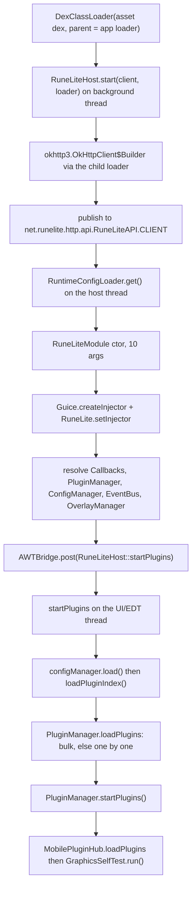
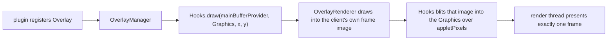

# Plugin runtime

**Audience:** developer
**Read this when:** you are working on the plugin host, host shims, plugin index, or config storage
**Verified against:** `android/src/main/java/org/runelite/mobile/host/RuneLiteHost.java`, `hostshims/src/**`, `android/build.gradle`, `android/plugin-exclusions.txt`, `android/src/main/java/org/runelite/mobile/MainActivity.java`

The port runs RuneLite's real `PluginManager`, `EventBus`, `ConfigManager` and `OverlayManager`
from the asset dex. What it does *not* run is the desktop shell those managers normally assume.
This page covers how the runtime is bootstrapped, how the plugin list reaches it without Guava's
classpath scan, where config is written, what the shims replace, and the two cross-loader rules
that keep the app dex and the asset dex from reaching into each other illegally.

For the class-loader topology see [architecture.md](architecture.md); for the shim compile task
see [build-and-release.md](build-and-release.md); for the conformance/observability surface see
[diagnostics.md](diagnostics.md).

## 1. Why a plugin runtime needed porting

Upstream RuneLite discovers plugins with Guava's `ClassPath.from(classLoader)`, which walks
`java.class.path` on the JVM. On ART there is no classpath to walk: classes come from a dex file
loaded by a `DexClassLoader`, and `ClassPath.from` returns nothing useful. The port therefore
**turns the plugin list into a build artifact**. `downloadAndDexJar` scans the cleaned RuneLite
client jar and writes `runelite-plugin-index.txt` into the asset dex (`android/build.gradle`,
`generatePluginIndex`). At startup `RuneLiteHost.loadPluginIndex()` reads that resource back off
the child loader and feeds the classes to `PluginManager` (`RuneLiteHost.loadPluginIndex`).

`PluginManager.loadPlugins` instantiates every class through a Guice child injector and lets a
`PluginInstantiationException` escape. One plugin whose injected types cannot be resolved would
therefore take down the whole runtime. The host compensates with a **bulk-then-per-class
fallback**: it calls `loadPlugins` once with the whole list (which is also what builds RuneLite's
`@PluginDependency` ordering), and if that throws it retries one candidate at a time, recording
each failure and continuing (`RuneLiteHost.startPlugins`, comment at `RuneLiteHost.java:266-272`).

## 2. Startup sequence

`MainActivity` builds the child loader with the app classloader as parent, then starts the host on
a daemon thread:



Numbered, with the exact calls:

1. `MainActivity` constructs `new DexClassLoader(dexJar, dexOut, null, getClassLoader())`
   (`MainActivity.java:295`, `:1392`) and starts `RuneLiteHost.start(clientObject, dexClassLoader)`
   on a daemon `Thread` named `RuneLiteHost`.
2. `RuneLiteHost.start` builds an `okhttp3.OkHttpClient$Builder` reflectively through the child
   loader (`RuneLiteHost.java:167-174`): `connectTimeout(20, SECONDS)`, `readTimeout(20, SECONDS)`,
   the same shape as RuneLite's own `buildHttpClient()`.
3. It publishes that instance to the static field `net.runelite.http.api.RuneLiteAPI.CLIENT`
   (`RuneLiteHost.java:176`), because the http-api module and every RuneLite HTTP client share the
   one instance.
4. `net.runelite.client.RuntimeConfigLoader` is constructed with the OkHttp instance and its `get()`
   runs the blocking runtime-config fetch **on the host thread** (`RuneLiteHost.java:181-189`). A
   null result is normal offline and only disables feature flags.
5. `net.runelite.client.RuneLiteModule` is constructed with ten parameters — `okHttpClass`,
   `Supplier`, `runtimeConfigLoaderClass`, `developerMode=false`, `safeMode=false`,
   `disableTelemetry=true`, the session `File`, profile `null`, `insecureWriteCredentials=false`,
   `noupdate=true` (`RuneLiteHost.java:196-206`). The client `Supplier` is `() -> client`.
6. `com.google.inject.Guice.createInjector` is invoked with a one-element `Module[]` array built by
   `java.lang.reflect.Array`, because `com.google.inject.Module` is an asset-dex type
   (`RuneLiteHost.java:208-215`). The result is stored and handed to
   `net.runelite.client.RuneLite.setInjector`, which `PluginManager.instantiate()` uses to build
   child injectors (`RuneLiteHost.java:216-217`).
7. It **deliberately does not call `injector.injectMembers(client)`** (`RuneLiteHost.java:219-225`).
   Upstream `RuneLite.start()` injects the client *before* `client.initialize()`; here the client
   is already wired by `MainActivity` (the `Callbacks` proxy, the scheduler, the token requester).
   Injecting now would replace the client's `Callbacks` field with `Hooks` directly, bypassing the
   proxy's frame blit and leaving the render thread waiting on `frameSeq` forever — a black screen
   with a live runtime.
8. `installNavigationHook` installs the `ClientToolbar.navigationListener` field (`RuneLiteHost.java:218`,
   `:727-744`), then the components are resolved by name through `get(...)`:
   `net.runelite.api.hooks.Callbacks`, `net.runelite.client.plugins.PluginManager`,
   `net.runelite.client.config.ConfigManager`, `net.runelite.client.eventbus.EventBus`,
   `net.runelite.client.ui.overlay.OverlayManager`, and optionally
   `net.runelite.client.callback.ClientThread` (`RuneLiteHost.java:228-239`).
9. `AWTBridge.post(RuneLiteHost::startPlugins)` hands the lifecycle to the UI thread
   (`RuneLiteHost.java:249`). `PluginManager` asserts the event-dispatch thread and calls
   `SwingUtilities.invokeAndWait` internally; on this port `AWTBridge.registerUiThread` routes both
   to the Android main thread.
10. `startPlugins` runs on the EDT: sets `jagex.disableBouncyCastle` and
    `runelite.pluginhub.version`, calls `configManager.load()`, reads the plugin index, loads
    plugins (with the fallback above), calls `loadDefaultPluginConfiguration`, registers the three
    managers on the bus, calls `overlayManager.init()`, and finally `pluginManager.startPlugins()`
    (`RuneLiteHost.java:252-304`). Then `MobilePluginHub.loadPlugins` sideloads hub jars and
    `GraphicsSelfTest.run()` validates the draw surface.

All the injector's products are typed as `Object` and reached reflectively: `RuneLiteHost` stores
no `net.runelite.*` type in a field signature, so the app dex never links the asset dex at compile
time.

## 3. Plugin index lifecycle

`generatePluginIndex(File jar)` runs inside `downloadAndDexJar` and produces
`runelite-plugin-index.txt` at the asset root (`android/build.gradle:239-286`, `:596-600`):

| Step | Rule |
|---|---|
| Candidate | zip entry name ends with `.class` and lives under `net/runelite/client/plugins/` |
| Parse | ASM `ClassReader.SKIP_CODE \| SKIP_DEBUG \| SKIP_FRAMES` into a `ClassNode` |
| Superclass | `node.superName == "net/runelite/client/plugins/Plugin"` — direct subclass only |
| Annotation | visible `Lnet/runelite/client/plugins/PluginDescriptor;` |
| Filter | FQCN not listed in `android/plugin-exclusions.txt` |
| Output | sorted FQCNs, one per line, UTF-8; `#` and blank lines ignored by the reader |

The exclusion list is a build input (`android/plugin-exclusions.txt`), read by
`generatePluginIndex` and by nothing else. A class listed there is still present in the asset dex;
it is simply never instantiated. Admission rule (from the file's header): the plugin delivers its
function through the desktop Swing shell, or needs lwjgl / JNA / a desktop browser. The native
side panel replaces the shell but cannot host foreign `JPanel`s.

At the time of writing the list holds 16 FQCNs:

| Plugin FQCN | Why excluded |
|---|---|
| `config.ConfigPlugin` | desktop config shell; replaced by the native Config tab |
| `worldmap.WorldMapPlugin` | plugin-owned Swing window |
| `gpu.GpuPlugin` | needs a desktop GL stack |
| `devtools.DevToolsPlugin` | desktop inspector |
| `discord.DiscordPlugin` | needs the Discord SDK / desktop integration |
| `hiscore.HiscorePlugin` | plugin-owned window |
| `grandexchange.GrandExchangePlugin` | plugin-owned window |
| `worldhopper.WorldHopperPlugin` | desktop-only shell |
| `notes.NotesPlugin` | plugin-owned Swing panel |
| `timetracking.TimeTrackingPlugin` | plugin-owned Swing panel |
| `screenmarkers.ScreenMarkerPlugin` | Swing interaction |
| `skillcalculator.SkillCalculatorPlugin` | plugin-owned window |
| `screenshot.ScreenshotPlugin` | desktop screenshot path |
| `loottracker.LootTrackerPlugin` | Swing panel |
| `info.InfoPlugin` | `InfoPanel.<init>` NPE (`JEditorPane.getEditorKit().getStyleSheet()`) |
| `kourendlibrary.KourendLibraryPlugin` | `GroupLayout.createParallelGroup().addComponent(...)` NPE |

Excluding an entire plugin is the right call only when *nothing* in it can run. `@PluginDependency`
couples the list: `ClueScrollPlugin` declares `@PluginDependency(BankTagsPlugin)`, and
`PluginManager` refuses to instantiate a plugin whose dependency is missing
(`"Unmet dependency for ClueScrollPlugin: BankTagsPlugin"`). Bank tags is therefore deliberately
**kept** so the clue-scroll overlays survive — the comment in `android/plugin-exclusions.txt` is
the worked example to copy when adding an exclusion.

**Index size is a data-dependent number.** It is whatever `@PluginDescriptor`-annotated direct
`Plugin` subclasses the weekly client jar contains, minus the exclusions. Do not quote a fixed
count as a contract; the live value is `RuneLiteHost.indexSize()`, shown in the side panel Host
tab (`SidePanel.buildHostTab`).

**Failure mode.** `pluginManager.startPlugins()` stops at the first plugin whose `startUp()`
throws and leaves the remainder unstarted (`RuneLiteHost.java:478-482`). That is why "enabled" and
"active" are distinct: a plugin can be enabled (flag set) yet inactive (never started). The host
reports both, and a fresh toggle restarts from that plugin's flag rather than from the failing
one.

## 4. Config storage

The port does not implement config persistence; the client's own `ConfigManager` does. The port
supplies the directory it writes into:

- `MainActivity` sets `user.home` and `jagex.userhome` to `getFilesDir().getAbsolutePath()`
  (`MainActivity.java:198-199`, re-applied at `:1308-1309`).
- `RuneLiteHost.start` reads the static `net.runelite.client.RuneLite.RUNELITE_DIR` and derives the
  session file from it (`RuneLiteHost.java:191-194`). The port never assigns `RUNELITE_DIR`;
  upstream derives it under `user.home`, which is why config lands on internal storage.
- The `profiles2/` profile layout (`profiles.json` plus one `<name>-<id>.properties` per profile)
  is **upstream RuneLite behaviour inside the asset dex**, not verifiable from this tree. The
  legacy `settings.properties` file is likewise an upstream concern; the modern client stores
  profiles, not that file.

**Flush timing.** Upstream writes the profile file from `ConfigManager.sendConfig()`, which runs
from a `scheduleWithFixedDelay` task (minutes) and on a profile switch; the desktop process exits
gracefully, so the periodic flush has usually already happened. Android force-stops backgrounded
apps without warning, so the port calls `sendConfig` explicitly at points that matter
(`RuneLiteHost.flushConfig`, javadoc at `RuneLiteHost.java:425-432`):

| Caller | When |
|---|---|
| `SidePanel:732` | after a config item write in the Config tab |
| `SidePanel:741` | after a plugin enable/disable toggle |
| `RuneLiteHost.setPluginEnabled` (`:460`) | after a successful start/stop |
| `PluginConformance:216` | once at the end of a conformance run, if it touched config |
| `MainActivity:3333` | `onStop`, so a backgrounded app is flushed before the OS can kill it |

Without those flushes a plugin enablement or config edit survives only until the process is
force-stopped. `MainActivity.onStop` is the last line of defence; the side-panel calls make an
edit durable immediately.

## 5. `pluginConfigClass` resolution

RuneLite does not expose a plugin's config through a method on the plugin. `RuneLiteHost.pluginConfigClass`
(`RuneLiteHost.java:582-606`) resolves it structurally:

1. Null plugin → `null`.
2. Load `net.runelite.client.config.ConfigGroup` off the child loader as an `Annotation` subtype; if
   that fails → `null`.
3. Walk `plugin.getClass()` up through superclasses while `c != null && c != Object.class`.
4. For each declared field whose type is annotated `@ConfigGroup`, return that field type.
5. Else for each declared method with `parameterCount <= 1` whose return type is annotated
   `@ConfigGroup`, return the return type — this covers the `getConfig(ConfigManager)` shape.
6. Nothing annotated → `null`.

The annotation is `RUNTIME`-retained and `TYPE`-targeted, so the type alone identifies the config
interface. There is **no `getConfig()` call on the plugin object**. A plugin with no config
interface, such as `AccountPlugin`, returns `null`; the Config tab renders that as
`"this plugin has no configuration"` (`SidePanel.showConfigFor`, `:487-488`).

## 6. Host shims

`hostshims/` is **not a Gradle module**. Its sources are compiled by `compileHostShims()` inside
`android/build.gradle:189-233` and dexed into the **asset** dex
(`android/build.gradle:476-492`). Each shim's FQCN equals the upstream class it replaces (same
package and name), and `HOST_REPLACED_CLASSES` / `HOST_REPLACED_PREFIXES` strip the originals from
the cleaned client jar (`android/build.gradle:83-102`).

At the time of writing there are 26 shim files under `hostshims/src`. `kind` below is the shim's
own contract: **real** = logic the retained client depends on, **no-op** = methods that
deliberately do nothing, **data-only** = holds fields so call sites link but paints nothing.

| Shim file (`hostshims/src/net/runelite/client/ui/…`) | Replaces | Kind | State it holds |
|---|---|---|---|
| `Activatable.java` | `Activatable` | no-op interface | none; empty `onActivate`/`onDeactivate` defaults |
| `ClientToolbar.java` | `ClientToolbar` | real relay | `static volatile BiConsumer<String,Object> navigationListener`, `Injector` |
| `ClientUI.java` | `ClientUI` | mixed (real queries + no-ops) | `Injector`, cached `GraphicsConfiguration` |
| `ContainableFrame.java` | `ContainableFrame` | data-only | enum `Mode { ALWAYS, RESIZING, NEVER }` (persisted constants) |
| `FatalErrorDialog.java` | `FatalErrorDialog` | no-op | none; fluent methods return `this` |
| `MultiplexingPluginPanel.java` | `MultiplexingPluginPanel` | data-only | `Deque<PluginPanel> stateStack`, `current` |
| `NavigationButton.java` | Lombok `NavigationButton` | real data class | `icon`, `tooltip`, `onClick`, `panel`, `priority`, `popup` |
| `PluginPanel.java` | `PluginPanel` | data-only | `JScrollPane`, `JPanel`; constants `225`/`17`/`6` |
| `SplashScreen.java` | `SplashScreen` | no-op static | none |
| `UnitFormatterFactory.java` | `UnitFormatterFactory` | no-op | `delegateFactory`, `units`; `getFormatter` → null |
| `components/ColorJButton.java` | `ColorJButton` | data-only | `Color color` |
| `components/DimmableJPanel.java` | `DimmableJPanel` | data-only | `boolean dimmed` + fg/bg colours |
| `components/DragAndDropReorderPane.java` | same | data-only | `List<DragListener>` |
| `components/FlatTextField.java` | `FlatTextField` | real data + no-op focus | `JTextField`, colours, `blocked` |
| `components/IconTextField.java` | `IconTextField` | data-only | `FlatTextField`, suggestion model, `Icon` |
| `components/MouseDragEventForwarder.java` | same | no-op | `Component target` |
| `components/PluginErrorPanel.java` | `PluginErrorPanel` | no-op | none |
| `components/ProgressBar.java` | `ProgressBar` | data-only | `maximumValue`, `value`, `positions`, labels |
| `components/ThinProgressBar.java` | `ThinProgressBar` | data-only | `maximumValue`, `value` |
| `components/TitleCaseListCellRenderer.java` | same | ctor only | none |
| `components/VirtualList.java` | `VirtualList` | abstract data-only | erased `model`, `int keepUnused` |
| `components/colorpicker/ColorPickerManager.java` | same | real factory, no-op UI | `Injector` |
| `components/colorpicker/RuneliteColorPicker.java` | same | data-only | `Color selectedColor`, change/close consumers |
| `components/materialtabs/MaterialTab.java` | `MaterialTab` | data-only | `tabName`, `onSelectEvent`, `selected` |
| `components/materialtabs/MaterialTabGroup.java` | same | data-only | `List<MaterialTab> tabs` |
| `components/shadowlabel/JShadowedLabel.java` | `JShadowedLabel` | data-only | `shadow`, `shadowSize` |

### 6.1 Compiler rules for shims

`compileHostShims` sets the classpath explicitly (`android/build.gradle:190-199`):

```gradle
def classpath = [coreClasses.absolutePath]
['client-', 'runelite-api-', 'guice-', 'javax.inject-', 'guava-', 'okhttp-', 'gson-', 'http-api-'].each { … }
classpath.add(new File(android.sdkDirectory, "platforms/android-34/android.jar").absolutePath)
```

and invokes `javac` with `--limit-modules java.base,jdk.unsupported`
(`android/build.gradle:206-212`). Three consequences govern every shim:

1. **Shims live in `hostshims/`, not the app source set.** They replace client-jar classes and must
   be dexed into the *asset* dex so Guice can resolve the types in their signatures — for example
   `net.runelite.api.Client` in `ColorPickerManager.create`. The build comment records that a shim
   placed in the app dex made those descriptors unresolvable and broke the 7 plugins that inject a
   shim (`android/build.gradle:178-188`).
2. **Constructor parameters must be asset-dex-resolvable.** Guice constructs the shim from the
   client loader, so a parameter type that only exists in the app dex cannot be supplied. That is
   why `ClientToolbar` and `ClientUI` take an `Injector` instead of upstream's `ClientUI` /
   `RuneLiteConfig` / `MouseManager` / `Client`.
3. **Method signatures must match upstream exactly.** The caller is pre-compiled bytecode in the
   asset dex; a changed descriptor is a `NoSuchMethodError` at runtime. Keep names, parameter
   types, return types and the constant values of fields/enums that get persisted.

One nuance worth stating precisely: `org.runelite.mobile.*` types that live in **`core/`** *are*
on the shim compile classpath (rule 1 above lists `coreClasses`), and the shim can resolve them at
runtime because the asset loader's parent is the app loader (`MainActivity.java:295`). `ClientUI`
uses that to read `AWTBridge.activeWidth` / `activeHeight`. What a shim must **not** do is
reference the `android/` host package (`RuneLiteHost`, `PluginPanelRegistry`): those classes are
not on the shim classpath, and the loader direction is one-way. The `ClientToolbar` shim therefore
exposes a plain `BiConsumer` field that `RuneLiteHost.installNavigationHook` fills in
reflectively, rather than calling the registry directly (`ClientToolbar.java` javadoc).

### 6.2 Nested-class stripping and the four no-shim entries

`HOST_REPLACED_CLASSES` controls **stripping**, `hostshims/` controls **replacement**; they are
different sets. `isHostReplaced` treats a class as host-replaced if the entry name equals
`outer + '.class'` **or** starts with `outer + '$'` (`android/build.gradle:104-124`). Nested classes
are dropped with their outer because d8 refuses an orphan nest member
(`"Class X$Y requires its nest host"`).

Four entries in `HOST_REPLACED_CLASSES` deliberately have **no** shim and are simply absent after
stripping (their referrers are stripped too):

| Entry | Why no shim |
|---|---|
| `ClientPanel` | desktop under the `ui/` package prefix only; nothing retained references it |
| `ClientToolbarPanel` | same |
| `OSXFullScreenAdapter` | macOS-only desktop class |
| `UnitFormatter` | referenced only by the desktop shell path |

`HOST_REPLACED_PREFIXES` is `net/runelite/client/ui/laf/` and `net/runelite/client/ui/components/`
(`android/build.gradle:99-102`). No `laf/` shim exists (the whole prefix is dropped); `components/`
strips all upstream component classes but only the 16 listed above are re-provided — the rest are
absent.

## 7. Overlay rendering path

Overlays are drawn by RuneLite's own `Hooks` (`net.runelite.api.hooks.Callbacks`), not by the
port. The path from the plugin side is:



The registration entry point is `OverlayManager.add` / `addIfAbsent`, driven by the plugin's
`startUp()`. `overlayManager.init()` is called once at boot (`RuneLiteHost.startPlugins`). When
the client calls `callbacks.draw(MainBufferProvider, Graphics, x, y)`, `MainActivity`'s `Callbacks`
proxy looks up the matching method on `RuneLiteHost.hooks()` and invokes it inside `renderLock`;
`Hooks` renders the overlays into `mainBufferProvider.getImage()` and blits that image into the
`Graphics` over `appletPixels` (`MainActivity.java:1510-1528`). Delegating to `Hooks` is what puts
plugins on screen; the frame/`frameSeq` handshake stays in the proxy so the render thread still
presents exactly one client frame per `draw`.

**Why overlays are absent on the login screen.** The `drawInterface` case records the interface id
and the number of registered `ABOVE_WIDGETS` overlays for it. That layer is rendered from
`renderAfterInterface`, so an overlay appears only while its interface is drawn. On the login
screen `iface=-1`, so `ABOVE_WIDGETS` overlays never render even though they are registered
(`MainActivity.java:1559-1570`). Everything registered on `ALWAYS_ON_TOP` is rendered first and is
not interface-gated.

## 8. The cross-loader link rule

The app dex and the asset dex are connected one-way: the asset loader's parent is the app loader
(`new DexClassLoader(..., getClassLoader())`), so asset-dex code resolves app-dex classes, never
the reverse. Every link between the two sides is therefore reflective or field-installed, with two
standing rules:

- **App-dex code must not reference asset-dex types at compile time.** A scan of
  `android/src/main/java` for `import net.runelite.*`, `import com.google.inject.*` and
  `import okhttp3.*` returns nothing. Everything crosses by name: `RuneLiteHost` loads classes
  with `clientLoader.loadClass(...)`, calls them with reflection, and the `Callbacks`
  implementation is itself a `java.lang.reflect.Proxy` over an interface loaded from the child
  loader (`MainActivity.java:1465`). Injector products are held as `Object`.
- **Shims must not reference the `android/` host package.** They may use `core/` port types (which
  are on their compile classpath and in the app dex), but the host classes in `android/` are not
  visible to them. The one live link back to the host is the `ClientToolbar.navigationListener`
  `BiConsumer` field, installed reflectively by `RuneLiteHost.installNavigationHook`, which
  dispatches `"add"`/`"remove"`/`"open"` to `PluginPanelRegistry` (`RuneLiteHost.java:727-744`).

The two remaining categories of cross-loader call — the `Callbacks` proxy delegating to `Hooks`,
and the `MobilePluginHub` child loaders whose parent is the client loader — are the subject of
[architecture.md](architecture.md) and [third-party-plugins.md](third-party-plugins.md)
respectively. The shim/guice guarantees are checked mechanically by
`:android:verifyHostLinks` (see [tools.md](tools.md) and [build-and-release.md](build-and-release.md)).
