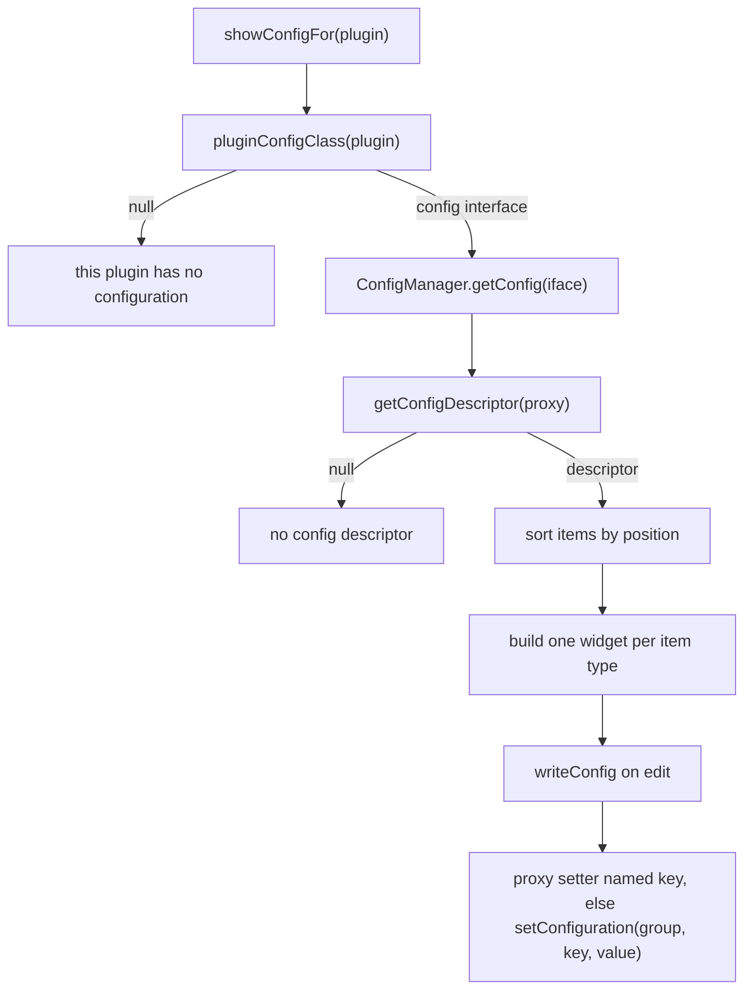

# Side panel

**Audience:** developer/operator
**Read this when:** you use, extend or debug the native side panel (plugins, config, host status) that replaces RuneLite's Swing client shell on Android
**Verified against:** `android/src/main/java/org/runelite/mobile/SidePanel.java`, `android/src/main/java/org/runelite/mobile/UiTheme.java`, `android/src/main/java/org/runelite/mobile/host/PluginPanelRegistry.java`, `android/src/main/java/org/runelite/mobile/host/RuneLiteHost.java`, `android/src/main/java/org/runelite/mobile/MainActivity.java`, `android/src/main/java/org/runelite/mobile/ClientUpdater.java`, `android/src/main/java/org/runelite/mobile/host/PluginConformance.java`

The side panel is the mobile replacement for RuneLite's desktop shell: a right-edge drawer with
three tabs. `SidePanel` is a plain `View` tree added to `MainActivity.rootLayout`, not an Activity;
it owns no client state of its own and reads everything through static accessors on `RuneLiteHost`
(`SidePanel` class javadoc, `SidePanel`). Plugin Swing panels are never rendered.

## 1. Opening the drawer

`SidePanel` is constructed once, with no size argument, and inserts itself into the root frame
(`MainActivity.buildLauncherUi`, `sidePanel = new SidePanel(this, rootLayout)`). It sizes itself from
the display metrics: drawer width `min(0.42 * widthPixels, 380 * density)`, column width
`44 * density`.

One affordance opens it: the persistent right-edge **column** (`SidePanel.column`), 44 dp wide and
full height, whose upper child is the chevron handle (`‹` closed / `›` open) and whose lower child is
the keyboard toggle (`⌨`). The handle's `OnTouchListener` toggles on `ACTION_UP` and always returns
`true`; the keyboard toggle is a normal click listener that calls
`Listener.onKeyboardToggleRequested()` (`MainActivity.toggleKeyboardBar`).

There is no floating ☰/⚙ button any more: the launcher shortcut is the `⌂` button in the drawer
header (`Listener.onShowLauncherRequested` → `MainActivity.showLauncher`).

**The drawer takes screen space instead of covering the game.** The host reads
`sidePanel.occupiedWidthPx()` (`column` + `drawer` while open) and insets the game `SurfaceView` and
the keyboard bar by it (`MainActivity.applyGameInsets`, driven by `Listener.onOpenChanged`), so
opening the drawer fires `surfaceChanged` with a smaller surface and the game reletterboxes to the
reduced area — nothing is overlapped and the touch mapping follows (see [input.md](input.md) §1). The
chrome is shown/hidden by `setAvailable(boolean)`: `false` on the launcher screen and after a failed
boot (the drawer must not float over the launcher), `true` from `launchGame`.

**Ordering guarantee.** `MainActivity.buildLauncherUi()` adds views to `rootLayout` in this order:
`surfaceView` → launcher scroll → boot overlay → `kbBar` → side-panel container (added from the
`SidePanel` constructor) → `loginOverlay` last. Because the login overlay is added last, it covers
the drawer; the column and the drawer body swallow touches inside their own bounds via an
`OnTouchListener` that returns `true` for every event except `ACTION_OUTSIDE`, so a tap outside the
drawer still reaches the game surface underneath. Child views receive their events before the parent
listener, which is why the handle and the keyboard toggle keep working.

`toggle()` flips `open`, calls `applyState()` (drawer `VISIBLE`/`GONE`, chevron glyph, listener
notify) and persists `sidePanelOpen`. `open()`, `close()` and `isOpen()` are the programmatic forms.
`refreshPlugins()` is a no-op while the drawer is closed.

Immediately under the tab row the drawer shows a `hostStatus` line carrying
`RuneLiteHost.status()`; `setHostStatus` updates it and re-renders the
Host tab when that tab is active, and `refreshPlugins()` feeds it the current status. It is a
convenience mirror of the `status` row on the Host tab, visible from any tab.

### Touch ownership

The drawer deliberately does not intercept game input outside itself. The container is
`MATCH_PARENT` with `setClipChildren(false)`, but only the column and the drawer body install the
swallowing `OnTouchListener`; everywhere else in the container the event falls through to the surface
below. Keep this property when adding child views — a full-container click listener would eat the
whole screen.

## 2. Plugins tab

Tab constants are `TAB_PLUGINS=0`, `TAB_CONFIG=1`, `TAB_HOST=2`; the titles are the literals
`{"Plugins", "Config", "Host"}`. The tabs are equal-weight `TextView`s; `selectTab` persists
`sidePanelTab`, swaps their backgrounds (selected: translucent gold fill + gold stroke and gold text;
unselected: transparent + border and muted text), and shows the plugin search field only on this tab.

`buildPluginRows(filter)` builds the list from `RuneLiteHost.plugins()`:

- **Empty states.** If no plugins are loaded it shows `"no plugins loaded"` when the host is running,
  otherwise `"RuneLite runtime not running: " + RuneLiteHost.status()`. If a filter matches nothing
  it shows `"no plugin matches \"<filter>\""` (`SidePanel`, `:362-364`).
- **Sorting and filtering.** Rows are sorted case-insensitively by `RuneLiteHost::pluginName`; the
  filter matches on name or `@PluginDescriptor.description`.
- **Row.** A `Switch` is initialised from `RuneLiteHost.isPluginEnabled(plugin)` and its listener
  calls `RuneLiteHost.setPluginEnabled(plugin, isChecked)`. On failure it reverts the switch and
  toasts `"could not enable/disable <name>"`; on success it toasts the new state. The switch is tinted
  by state (`UiTheme.tintSwitch`: gold thumb + translucent gold track when checked, muted grey thumb +
  dark track when not), because a single gold thumb for both states made the state unreadable. A
  `Switch` reflects the persisted **enabled** flag, not whether the plugin actually started
  (`isPluginEnabled` vs `isPluginActive` — see [plugin-runtime.md](plugin-runtime.md)). The row also
  carries a platform ripple (`UiTheme.ripple`).

**Registered-panel block.** After the plugin rows, if `PluginPanelRegistry.names()` is non-empty the
tab appends the label `"registered panels (Swing, not available on mobile):"` and one row per name:
`"• <name> — tap to open its config"`. Tapping a row calls
`showConfigFor(name)`, which jumps to the Config tab. The names are the tooltips of the navigation
buttons that RuneLite's `ClientToolbar` reported through the host's toolbar hook; the registry
mechanism is documented in [plugin-runtime.md](plugin-runtime.md).

The list updates live: `navigationAdded`/`navigationRemoved` rebuild it when this tab is selected,
and `panelOpened` calls `showConfigFor(name)`.

## 3. Config tab

The Config tab opens on a plugin list built by `buildConfigPluginList()` — every loaded plugin sorted
by name, each row opening `showConfigFor(plugin)`. `showConfigFor(String)`
resolves the name case-insensitively and falls back to the plain list when nothing matches.

`showConfigFor(Object)` renders the form:

1. **Header.** The plugin name, or `"<name> (disabled)"` in amber when the plugin is disabled.
2. **Enable row.** When disabled, an orange row reading
   `"<name> is disabled — config changes do nothing. Tap to enable."`; tapping calls
   `RuneLiteHost.setPluginEnabled(plugin, true)` and re-renders. This
   exists because the tab edits config for disabled plugins too, and without the warning a
   no-op setting reads as a broken plugin.
3. **Resolution.** `RuneLiteHost.pluginConfigClass(plugin)` returns the `@ConfigGroup` interface;
   `null` yields `"this plugin has no configuration"`. The interface is
   resolved to a proxy with `ConfigManager.getConfig(iface)` and a descriptor with
   `getConfigDescriptor`; a missing descriptor yields `"no config descriptor"`, and an empty item
   list yields `"no configuration items"`.
4. **Items.** Descriptors are sorted by `position`; a `@ConfigItem(section=…)` value that differs
   from the previous item emits a section header. A failure in a single
   item is logged as `"config item failed"` and skipped; a failure building the whole form shows
   `"config unavailable: <throwable>"`.
5. **`pluginConfigClass` resolution** is documented in [plugin-runtime.md](plugin-runtime.md): it
   finds a declared field (or a helper method's return type) annotated `@ConfigGroup`; plugins such
   as `AccountPlugin` resolve to `null`, which is the `"no configuration"` path above.

**Widget mapping** (`buildConfigWidget`, `SidePanel`):

| Java type | Widget | Write trigger |
|---|---|---|
| `boolean` / `Boolean` | `Switch` | `onCheckedChange` |
| `int` / `Integer` | `SeekBar` + value label | `onStopTrackingTouch` (int) |
| `double` / `Double` | `SeekBar` + value label | `onStopTrackingTouch` (double) |
| `String` | `EditText` (password input when `@ConfigItem(secret=true)`) | focus lost |
| `java.awt.Color` | `Button` showing `#RRGGBB`, opens a hex dialog | dialog Apply |
| enum | `Spinner` of constant names | `onItemSelected` |
| anything else | read-only label `"<value>  (not editable on mobile)"` | — |

The `SeekBar` range comes from the item's `@Range`; when there is no `@Range` (or `max <= min`) the
default `{0, 100}` is used (`configRange`, `SidePanel`). Non-editable types are
rendered but never written; unknown widget types are a signal that the plugin needs a native control,
not a config-storage problem.

## 4. Host tab

`buildHostTab()` renders one row per diagnostic:

| Row label | Source |
|---|---|
| `client version` | `RuneLiteHost.clientVersion()` |
| `runtime` | `"running"` / `"not running"` (`isRunning()`) |
| `plugin index` | `RuneLiteHost.indexSize() + " classes"` |
| `active plugins` | `RuneLiteHost.activePluginCount()` |
| `status` | `RuneLiteHost.status()` |
| `last error` | `RuneLiteHost.failure()`, or `"none"` |
| `plugin load failures` | `size()` plus each entry as an indented red line |
| `client AOT` | `ClientUpdater.clientDexAotStatus/Text(activity)`; drawn red when stale/missing |
| `on-device dexer` | literal `"unavailable"` |
| `conformance` | `PluginConformance.isRunning() ? "running…" : lastSummary()` |

Two action pills follow (plain `TextView`s with a gold-on-stone background, not platform `Button`s —
`UiTheme.pillButton`):

- **`Run plugin conformance`** — enabled only when
  `!PluginConformance.isRunning() && RuneLiteHost.isRunning()`. It calls
  `PluginConformance.run(activity)` and toasts `"conformance running — report: <file name>"`. The
  metrics are documented in [diagnostics.md](diagnostics.md).
- **`Refresh`** — `refreshPlugins()` then `buildHostTab()`.

The `on-device dexer` row is a hardcoded literal; it does not query `OnDeviceDexer.isAvailable`. The
`client AOT` semantics and the fix command come from [client-updates.md](client-updates.md) and
[device-runbook.md](device-runbook.md).

## 5. The Color config item encoding rule

A `java.awt.Color` config value must be persisted as the **decimal ARGB int**
`String.valueOf(color.getRGB())` — never as hex. `SidePanel.stringify` does exactly this, because that is the form RuneLite's own code round-trips:
`ConfigManager.objectToString` writes a `Color` as its decimal `getRGB()`, and `ColorUtil.fromString`
reads it back with `Integer.decode(...)` followed by `new Color(int, true)`.

A hex string is lost. `Integer.decode("00FF00")` treats the leading zero as an octal prefix and
throws `NumberFormatException`, so the value comes back `null` — a silent config loss, not an error.
The picker dialog is titled `"Colour (hex RRGGBB)"` and parses hex for the user, then builds
`new java.awt.Color(rgb & 0xFFFFFF)` before writing; the hex is display
only.

**Write path.** `writeConfig` prefers invoking the one-argument setter
named exactly like the config key on the config proxy, so RuneLite fires `ConfigChanged` and
plugins react. Only when no such setter exists does it fall back to
`ConfigManager.setConfiguration(group, key, stringify(value))`, which RuneLite converts back using
the item's declared type. Both paths then call `RuneLiteHost.flushConfig()`.

## 6. Persistence

Two independent stores are involved:

| State | Store | Keys / form | Written by |
|---|---|---|---|
| Drawer open/closed, selected tab | `RuneLiteMobilePrefs` (`SharedPreferences`) | `sidePanelOpen`, `sidePanelTab` | `toggle()`; `selectTab` |
| Plugin enablement and config values | RuneLite's own profile properties file (via `ConfigManager`) | one file per profile under `RUNELITE_DIR` | the write paths above |

`RuneLiteMobilePrefs` is the same file the launcher uses for its UI state; `SidePanel` writes only
those two keys. Plugin state is **not** stored
there — it lives in RuneLite's profile file, which sits under the app's files directory because
`user.home` is redirected to `getFilesDir()` by `MainActivity.onCreate`. The profile layout itself is
upstream RuneLite behaviour (see [plugin-runtime.md](plugin-runtime.md)).

**Why the explicit flush.** RuneLite normally writes the profile only from its own
`ConfigManager.sendConfig()` scheduled task (minutes) or on a profile switch; Android force-stops
backgrounded apps without warning, so an edit made in the panel could be lost. `SidePanel` therefore
calls `RuneLiteHost.flushConfig()` after every panel-driven write (`writeConfig`),
and `RuneLiteHost.setPluginEnabled` flushes after a successful enable/disable
(`RuneLiteHost.setPluginEnabled`). `MainActivity` also flushes on `onStop` and `PluginConformance`
flushes after a config-touching run. `flushConfig` is a guarded reflection call to `sendConfig`; a
failure is logged as `"config flush failed"` (`RuneLiteHost`).
