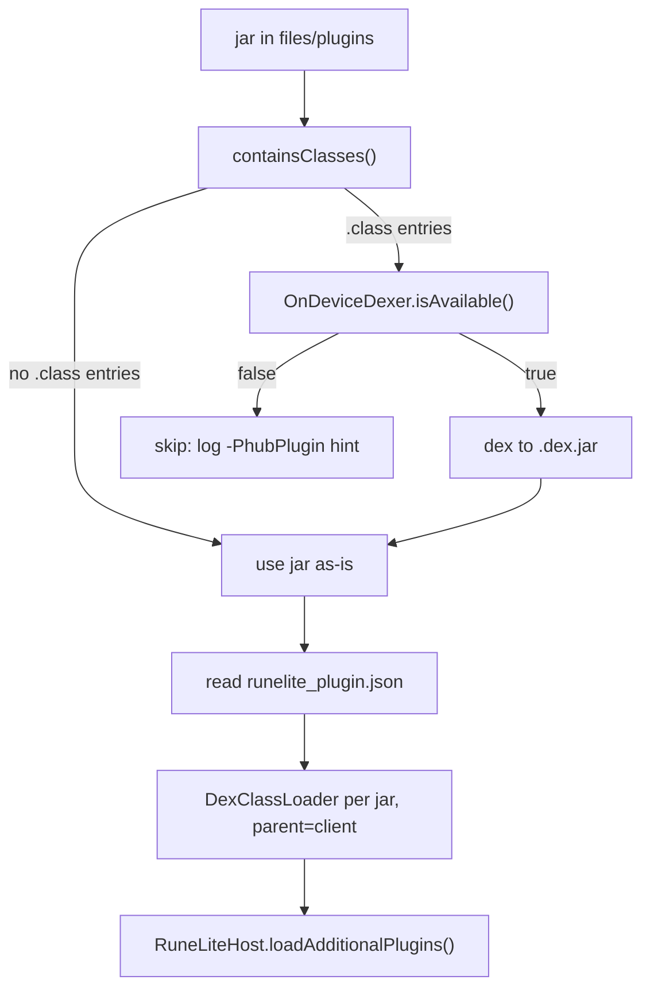

# Third-party (Plugin Hub) plugins

**Audience:** developer/operator
**Read this when:** you want to install a Plugin Hub plugin that is not bundled in the asset dex, or you are debugging why a sideloaded plugin never loads.
**Verified against:** `android/src/main/java/org/runelite/mobile/host/MobilePluginHub.java`, `android/src/main/java/org/runelite/mobile/host/OnDeviceDexer.java`, `android/src/main/java/org/runelite/mobile/host/RuneLiteHost.java`, `android/build.gradle` (`dexHubPlugin`)

The asset dex (`assets/runelite-dex.jar`) ships a fixed set of core plugins chosen at build
time; see [plugin-runtime.md](plugin-runtime.md). Third-party plugins from the RuneLite Plugin
Hub are not in that dex, so they are dropped onto the device as separate jars and loaded by a
second, per-jar `DexClassLoader`. This page covers the drop-box directories, the import and
read-only rules, on-device dexing, and the host-side `dexHubPlugin` alternative.

For what a loaded plugin then does — descriptor scanning, config, shims — see
[plugin-runtime.md](plugin-runtime.md).

## 1. Drop-box directories

`MobilePluginHub.loadPlugins(context, clientLoader)` scans two directories
(`MobilePluginHub.java:55`):

| Directory | Path | Role |
|---|---|---|
| private | `context.getFilesDir()/plugins` | created if missing; the canonical store the loader reads from |
| external | `context.getExternalFilesDir(null)/plugins` | the adb-push drop box; jars here are imported into the private dir first |

The external dir is the only location a release build can be pushed to without root, because
the release APK is not debuggable (no `run-as` access to private storage). The printed
install hint from `dexHubPlugin` is:

```bash
adb push android/build/hub-dex/dexed/<internalName>_<jarHash>.jar \
  /sdcard/Android/data/org.runelite.mobile/files/plugins/<internalName>_<jarHash>.jar
```

The path literal comes from `android/build.gradle` (`android.defaultConfig.applicationId` at
`android/build.gradle:20`, printed at `android/build.gradle:730-731`). On some devices the
same directory is also reachable as `/storage/emulated/0/Android/data/...`; it is the
app-scoped external files directory either way.

Only files whose name ends in `.jar` are considered. An empty directory logs
`no jars in <path>`; otherwise `found <n> jar(s) in <path>` (`MobilePluginHub.java:74-78`).

## 2. Import and the read-only rule

Jars found in the external drop box are **copied** into the private dir, with an 8 KiB buffer,
when the target is absent or its length differs from the source (`MobilePluginHub.java:80-104`).
If a previous import exists it was made read-only for ART, so before replacing it the loader
calls `imported.setWritable(true, true)` then deletes it (`MobilePluginHub.java:93-100`).
Private-dir jars are added as-is.

**Why read-only matters.** ART refuses to load a dex that is writable by others:

```text
Writable dex file '/…/foo.jar' is not allowed.
```

A jar living on shared/external storage is exactly that, so every jar is forced through
`setWritable(true, true)` then `setReadOnly()` immediately before the `DexClassLoader` is
constructed (`MobilePluginHub.java:143-144`), and the extracted dexer asset gets the same
treatment (`OnDeviceDexer.java:78-79`). If you see the `Writable dex file` message in logcat,
a jar reached a loader without this step; see [troubleshooting.md](troubleshooting.md).

## 3. `.class` jars vs pre-dexed `.dex.jar`

A Plugin Hub jar is Java 11 `.class` bytecode, which ART cannot load. `containsClasses(jar)`
opens the zip and returns true if any entry ends in `.class` (`MobilePluginHub.java:173-191`).



When the jar still holds `.class` entries, `dexOnDevice` (`MobilePluginHub.java:193-206`) runs
the bundled dexer. It reuses an existing `<base>.dex.jar` when that sibling is non-empty and
at least as new as the raw jar, otherwise it calls `OnDeviceDexer.dex`. When the dexer is not
available it logs the exact workaround:

```text
on-device dexer unavailable (<reason>); dex <name> on the host with -PhubPlugin=<name>
```

A raw jar and its `.dex.jar` sibling coexist after the first successful run. The dedup pass
(`MobilePluginHub.java:107-120`) skips the raw jar when a non-empty `<base>.dex.jar` sibling
exists, so `PluginManager` does not instantiate the same plugin twice.

### On-device dexing

`OnDeviceDexer` drives the R8/D8 compiler shipped as `assets/rl-dexer.jar`
(`OnDeviceDexer.java`). The dexer is a full Java program (thousands of classes), so it lives
in its own asset dex and is loaded lazily:

1. `ensureLoaded` extracts `assets/rl-dexer.jar` to `getFilesDir()/rl-dexer.jar` once
   (`OnDeviceDexer.java:54-90`).
2. It creates `DexClassLoader(jar, files/dex-r8, null, OnDeviceDexer.class.getClassLoader())`
   — the parent is the **app** classloader, not the client loader.
3. It forces `dexerLoader.loadClass("com.android.tools.r8.D8")` so `isAvailable()` is truthful,
   then logs `on-device dexer ready (<n> bytes)`.

`dex(context, classJar, outputJar)` reflects the D8 builder chain
(`OnDeviceDexer.java:99-192`):

| Reflection step | Actual API |
|---|---|
| `D8Command.builder()` | factory |
| `addProgramFiles(Path[])` | program input, wrapped as `Paths.get(classJar…)` |
| `setMinApiLevel(26)` | matches `minSdk 26` |
| `setOutput(Path, OutputMode.DexIndexed)` | output dir + mode |
| `build()` → `D8.run(D8Command)` | executes the compiler |

No tolerant/minimal D8 mode is set; D8 defaults apply. The dexed output jar contains the
produced `classes*.dex` plus every non-directory, non-`.class`, non-`META-INF/` resource from
the input (so `runelite_plugin.json`, icons and audio survive). Failure semantics: no produced
`.dex` logs `dexer produced no .dex for <name>`; any `Throwable` logs
`on-device dexing failed for <name>` and returns false. Success logs
`dexed <in> in <ms>ms -> <out> (<n> bytes)`.

## 4. Per-jar class loader and registration

For each loadable jar (`MobilePluginHub.java:132-163`):

1. `readPluginNames(jar)` opens the zip, reads the `runelite_plugin.json` entry, and parses
   `{"plugins":["<fqcn>", …]}` with Android's own `org.json` — deliberately not the asset
   dex's Gson (`MobilePluginHub.java:208-235`). A missing descriptor logs
   `no runelite_plugin.json in <name>; skipping`.
2. One `DexClassLoader(loadable, files/dex-hub, null, clientLoader)` is constructed per jar.
   The parent is the **client loader**, so hub plugins resolve the same `net.runelite.api` and
   `net.runelite.client` classes as core plugins.
3. Each descriptor FQCN is loaded; a failure logs `could not load <name> from <jar>`.
4. The loader is appended to the static `LOADERS` list and the names to `LOADED`. These are
   held for the whole process lifetime on purpose: dropping a loader would let ART unload the
   classes while plugins are still running.
5. The class list is handed to `RuneLiteHost.loadAdditionalPlugins(classes)`, which must run on
   the UI thread (`RuneLiteHost.java:360-401`). It calls `PluginManager.loadPlugins` +
   `loadDefaultPluginConfiguration` and then starts **only the newly-arrived plugins** that are
   enabled — re-running `startPlugins()` would restart plugins the boot sequence already
   decided about. A disabled arrival logs
   `sideloaded plugin <name> is disabled; enable it in the side panel`.

`MobilePluginHub.loadedPlugins()` returns a snapshot copy of `LOADED` and is the count the
side panel and conformance tooling read. The final log line is
`handed <n> hub plugin class(es) to PluginManager`.

**Enable a sideloaded plugin in the side panel** after it is loaded — it defaults to disabled
until `loadDefaultPluginConfiguration` records it; see [side-panel.md](side-panel.md).

## 5. Host-side alternative: `dexHubPlugin`

Instead of shipping a raw jar and dexing on the device, dex it on the build host:

```bash
./gradlew :android:dexHubPlugin -PhubPlugin=<internalName>
./gradlew :android:dexHubPlugin -PpluginJar=/path/to/plugin.jar [-PjarHash=<sha256-base64url>]
```

`android/build.gradle:625-732`. Run it after `syncRuneLiteJars`/`downloadAndDexJar` have
populated `build/rl-jars/version.txt`, which pins the hub manifest version
(`android/build.gradle:629`). See [build-and-release.md](build-and-release.md).

### Manifest branch (`-PhubPlugin`)

1. Fetch `https://repo.runelite.net/plugins/manifest/<version>_lite.js`
   (`android/build.gradle:657`) where `<version>` is `build/rl-jars/version.txt`.
2. The first 4 bytes are a **big-endian signature length**; the JSON begins at `4 + sigLen`
   (`android/build.gradle:660-662`).
3. Find the jar whose `internalName` matches (`android/build.gradle:663-666`); a miss throws
   `plugin '<name>' is not in the hub manifest for v<version>`.
4. Jar URL: `https://repo.runelite.net/plugins/jar/<internalName>_<jarHash>.jar`
   (`android/build.gradle:671`). The source jar is cached in `build/hub-dex/source/` and
   reused only when its **base64url** SHA-256 matches `jarHash`; otherwise it is downloaded
   and verified, and a mismatch deletes it and throws `SHA-256 mismatch`.

### Local-jar branch (`-PpluginJar`)

Point at any jar on disk. `-PjarHash` is optional (computed from the file when absent) and
`-PhubPlugin` is optional (defaults to the file name sans `.jar`) — `android/build.gradle:645-654`.

### Output and install

Both branches run the same d8 invocation with `--min-api 26` and
`--lib <sdk>/platforms/android-34/android.jar` (`android/build.gradle:702-705`; note the asset
pipeline has no `--lib`). The output is:

```text
android/build/hub-dex/dexed/<internalName>_<jarHash>.jar
```

that is, all `.dex` files plus the source jar's resources. The task prints the exact
`adb push` command from §1. Push into the **external** drop box; the app imports it on the
next scan (next start, or a hub rescan).

## 6. Failure modes

| What you see (logcat / UI) | Cause | Fix |
|---|---|---|
| `Writable dex file … is not allowed` | a jar reached `DexClassLoader` without being made read-only | ensure the jar is in the app's own storage; the loader chmods imports itself — see §2 |
| `on-device dexer unavailable (<reason>)` | `assets/rl-dexer.jar` missing or `com.android.tools.r8.D8` failed to load | dex on the host with `-PhubPlugin`, or rebuild the asset dex |
| `dexer produced no .dex for <name>` | D8 produced no output (bad input jar, unsupported bytecode) | check the input is a Java 11 `.class` jar; fall back to host dexing |
| `no runelite_plugin.json in <name>; skipping` | jar lacks the hub descriptor | push the jar as produced by `dexHubPlugin`, which preserves the descriptor |
| `could not load <name> from <jar>` | class missing or references unlinkable types | check the hub version matches the client version; see [troubleshooting.md](troubleshooting.md) |
| plugin loads but stays disabled | enabled flag is per-config and defaults off | enable it in the side panel; see [side-panel.md](side-panel.md) |

For on-device artifact paths and adb procedures, see [device-runbook.md](device-runbook.md).
For the conformance run that proves a loaded plugin actually behaves, see
[diagnostics.md](diagnostics.md).
